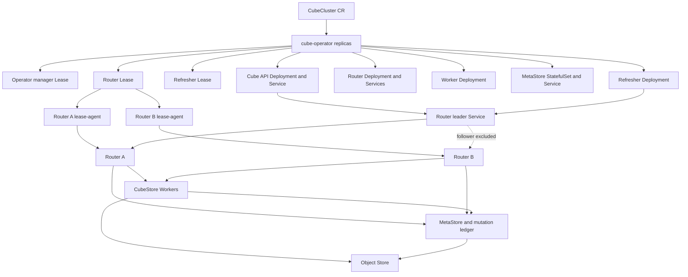

# Cube Operator Kubernetes-Native Full Cluster Design

**Date:** 2026-09-01

**Status:** Proposed, approved in principle; awaiting written-spec review

## 1. Goal

Provide one Kubernetes custom resource that deploys and continuously manages a complete Cube installation:

- Cube API
- Refresher
- CubeStore Router HA
- CubeStore Workers
- CubeStore MetaStore
- Services, storage, RBAC, disruption budgets, rollout, and status

Router and Refresher leadership must use Kubernetes-native `coordination.k8s.io/v1 Lease` resources. Redis and PostgreSQL must not be required solely for Cube Operator leadership or Router failover.

## 2. Design decisions

1. `CubeCluster` is the user-facing aggregate CRD.
2. Kubernetes Lease is the sole authority for Router and Refresher leadership.
3. `CubeCluster.status` is observational and must never grant leadership.
4. ConfigMaps distribute static or low-frequency configuration; they are not election locks.
5. A per-Router sidecar watches the authoritative Lease and atomically writes short-lived local leadership files.
6. Router promotion remains fail-closed and staged; short unavailability is allowed, overlapping leaders are not.
7. CubeStore MetaStore owns pre-aggregation mutation, Job, upload, and commit recovery state.
8. Kubernetes CRs are not used as a high-volume pre-aggregation Job queue.
9. Object storage owns durable upload parts, chunks, snapshots, and other shared files.
10. Existing completed pre-aggregations remain queryable while a replacement build is incomplete or failed.

## 3. Scope

### 3.1 In scope

- Install and reconcile the complete Cube workload from one CR.
- Kubernetes-native Router and Refresher leader election.
- Router fencing using Lease identity, generation, epoch, holder UID, token hash, and expiry.
- Router Service and EndpointSlice convergence.
- Cube API, Router, Worker, MetaStore, and Refresher rollout and health status.
- Durable pre-aggregation mutation and Job recovery using MetaStore and object storage.
- Upgrade, rollback, finalization, security, observability, backup, and failure testing.
- Migration from the existing `CubestoreRouter` CR and Redis/PG lease implementation.

### 3.2 Out of scope

- Building application-specific Cube images inside the Operator.
- Storing Cube schemas directly in CR status.
- Replacing application source databases.
- Implementing distributed object storage inside the Operator.
- Implementing MetaStore Raft as part of the first delivery milestone.
- Representing every query, upload part, Worker Job, or pre-aggregation build as a Kubernetes CR.
- Exactly-once semantics for arbitrary external systems that do not participate in the MetaStore mutation protocol.

## 4. Existing implementation disposition

| Existing area | Decision | Reason |
|---|---|---|
| Router local expiring leadership file | Retain | It provides data-plane fail-closed behavior independent of Service routing. |
| Router epoch/token/promotion checks | Retain and extend | Exact identity acknowledgment is required before routing traffic. |
| Candidate -> fenced -> ready -> promoted -> serving state machine | Retain and adapt | It safely handles Kubernetes multi-object, non-transactional updates. |
| EndpointSlice convergence check | Retain | It proves actual Service routing state rather than only label intent. |
| Driver leader probe and read-only retry | Retain | Reads can reconnect safely after Router failover. |
| Driver Redis idempotency | Replace | A Redis dependency conflicts with the Kubernetes-only control goal and does not atomically commit CubeStore metadata. |
| Redis/PostgreSQL Router LeaseStore | Replace | Kubernetes Lease is the native authority. |
| Redis-only lease-agent | Replace | The sidecar must watch Kubernetes Lease. |
| `CubestoreRouter` as the only public CRD | Migrate | It does not own the full Cube lifecycle. |
| Hard-coded recovery conditions | Replace with real probes | Current `Blocked` and `NeedsContext` values report missing runtime contracts rather than recovery readiness. |

## 5. Target architecture



## 6. Authority and persistence model

| State | Authority | Persistence | Update frequency |
|---|---|---|---|
| Operator active replica | Kubernetes Lease | Kubernetes API/etcd | Seconds |
| Router active replica | Per-cluster Kubernetes Lease | Kubernetes API/etcd | Seconds |
| Refresher active replica | Per-cluster Kubernetes Lease | Kubernetes API/etcd | Seconds |
| Desired cluster topology | `CubeCluster.spec` | Kubernetes API/etcd | Low |
| Observed readiness | `CubeCluster.status` | Kubernetes API/etcd | Low |
| Router local permission | Sidecar-written leadership file | Pod-local `emptyDir` | Seconds |
| Router promotion acknowledgment | Router status endpoint | Runtime observation | Seconds |
| Pod traffic eligibility | Pod label and readiness | Kubernetes API | On role change |
| Actual Service routing | EndpointSlice | Kubernetes API | On endpoint change |
| CubeStore metadata | MetaStore | Persistent MetaStore storage | Workload rate |
| Mutation and Job recovery | MetaStore mutation ledger | Persistent MetaStore storage | Workload rate |
| Upload parts and chunks | Object store | Shared durable storage | Workload rate |
| Cube schemas/configuration | User image, ConfigMap, Secret, or PVC reference | Kubernetes/image registry | Deployment rate |

`CubeCluster.status`, ConfigMaps, and Pod labels are projections. None of them may independently grant Router or Refresher leadership.

## 7. Public API

### 7.1 Resource identity

```yaml
apiVersion: cubejs.io/v1alpha1
kind: CubeCluster
metadata:
  name: production
spec: {}
status: {}
```

The CR is namespace-scoped. All generated workload objects are created in the CR namespace for the first API version.

### 7.2 Proposed spec

```yaml
spec:
  cube:
    image: registry.example.com/cube-api:1.0.0
    replicas: 2
    service:
      type: ClusterIP
      port: 4000
    schema:
      configMapRef:
        name: cube-schema
    envFrom:
      - secretRef:
          name: cube-runtime-secrets
    resources: {}

  refresher:
    enabled: true
    replicas: 2
    ha:
      mode: KubernetesLease
      leaseDurationSeconds: 30
      renewDeadlineSeconds: 20
      retryPeriodSeconds: 5
    resources: {}

  cubestore:
    image: registry.example.com/cubestore:1.0.0
    router:
      replicas: 2
      service:
        port: 3030
        mysqlPort: 3306
      ha:
        mode: KubernetesLease
        leaseDurationSeconds: 30
        renewDeadlineSeconds: 20
        retryPeriodSeconds: 5
      resources: {}

    workers:
      replicas: 3
      resources: {}

    metaStore:
      mode: SinglePersistent
      persistence:
        size: 100Gi
        storageClassName: standard
      resources: {}

    objectStore:
      secretRef:
        name: cube-object-store
      bucket: cube-production
      prefix: cubestore

  availability:
    podDisruptionBudget: true
    topologySpread: true
```

### 7.3 Validation rules

- `cube.image` and `cubestore.image` are required and immutable only during an active rollback.
- Cube API replicas must be at least 1.
- Router replicas must be at least 2 when Router HA is enabled.
- Refresher replicas must be at least 2 when Refresher HA is enabled.
- Worker replicas must be at least 1.
- `renewDeadlineSeconds` must be less than `leaseDurationSeconds`.
- `retryPeriodSeconds` must be less than `renewDeadlineSeconds`.
- Object store Secret references must include a name.
- MetaStore persistence is required in `SinglePersistent` mode.
- Redis and PostgreSQL are not valid Router HA backend values.
- Plaintext credentials are rejected; only Secret references are accepted.

### 7.4 Status contract

```yaml
status:
  observedGeneration: 12
  phase: Ready
  cubeAPI:
    desiredReplicas: 2
    readyReplicas: 2
  refresher:
    desiredReplicas: 2
    readyReplicas: 2
    leader: production-refresher-7b97c
    leaseUID: 87b7...
    epoch: 4
  router:
    desiredReplicas: 2
    readyReplicas: 2
    leader: production-router-798fd
    leaseUID: a25e...
    leaseGeneration: f7e1...
    epoch: 18
    phase: Serving
  workers:
    desiredReplicas: 3
    readyReplicas: 3
  metaStore:
    ready: true
  recovery:
    mutationLedgerReady: true
    jobRecoveryReady: true
    uploadRecoveryReady: true
    refresherRecoveryReady: true
  conditions: []
```

Required conditions:

- `Ready`
- `CubeAPIReady`
- `RouterLeaseAcquired`
- `RouterPromotionReady`
- `RouterServiceReady`
- `WorkersReady`
- `MetaStoreReady`
- `ObjectStoreReady`
- `MutationRecoveryReady`
- `JobRecoveryReady`
- `RefresherReady`
- `Progressing`
- `Degraded`

## 8. Generated resources and ownership

The `CubeCluster` controller owns these resources through OwnerReferences:

- Cube API Deployment, Service, ConfigMap references, and PDB
- Refresher Deployment, ServiceAccount, Lease, and PDB
- Router Deployment, discovery Service, leader Service, ServiceAccount, Lease, and PDB
- Worker Deployment and PDB
- MetaStore StatefulSet, Service, PVC templates, and PDB
- Shared configuration ConfigMaps
- NetworkPolicies when enabled

User-provided Secrets, schema ConfigMaps, PVCs, and object-store buckets are referenced but not owned or deleted by the Operator.

Deleting a `CubeCluster` removes generated stateless resources. Persistent PVC and object data retention follow explicit retention policy fields and default to `Retain`.

## 9. Controller boundaries

### 9.1 CubeCluster reconciler

- Applies defaults and validates cross-field invariants.
- Reconciles all generated resources.
- Uses server-side apply with stable field managers.
- Computes status from Deployments, StatefulSets, Pods, Leases, Services, and EndpointSlices.
- Does not perform high-frequency Job or mutation reconciliation itself.

### 9.2 Router HA reconciler

- Selects only Ready Router Pods with valid status contracts.
- Acquires and renews the per-cluster Router Lease using conditional updates.
- Runs staged promotion.
- Writes traffic labels only after Router acknowledgment.
- Watches Router Pods explicitly and maps events to the owning `CubeCluster`.
- Uses periodic reconciliation as a safety net, not the primary failure detector.

### 9.3 Refresher HA reconciler

- Manages the Refresher Lease and status.
- Ensures only the active Refresher schedules new refresh work.
- Does not own pre-aggregation mutation records; those belong to MetaStore.

### 9.4 Runtime recovery reconciler

This is a CubeStore MetaStore service, not a Kubernetes controller. It scans expired mutation and Job ownership records, resolves authoritative outcomes, and reassigns recoverable work.

## 10. Kubernetes Lease protocol

### 10.1 Lease identity

Each `CubeCluster` owns a Router Lease named `<cluster>-router-leader` and, when enabled, a Refresher Lease named `<cluster>-refresher-leader`.

Router `holderIdentity` uses Pod UID, not Pod name. This prevents a recreated StatefulSet-style identity from inheriting stale authority.

Lease annotations contain:

```text
cubejs.io/lease-generation
cubejs.io/fencing-epoch
cubejs.io/fencing-token
cubejs.io/promotion-phase
cubejs.io/candidate-pod-name
```

`resourceVersion` is used only as the optimistic concurrency precondition. It is not parsed or compared as the application epoch.

### 10.2 Epoch and generation

- Every holder transition increments `fencing-epoch` in the same Lease update that changes `holderIdentity`.
- Renewals preserve epoch and token.
- A token change without an epoch change is invalid.
- Recreating a missing Lease generates a new `lease-generation` UUID.
- Router and Driver compare `(leaseGeneration, epoch, tokenHash)` rather than epoch alone.
- A generation change forces all existing Router connections to close and re-probe.

### 10.3 Sidecar behavior

Each Router Pod contains a read-only Lease watcher sidecar. It:

1. Gets and watches the Router Lease.
2. Verifies holder UID, generation, epoch, token, and lease duration.
3. Establishes a local expiry deadline from observation time plus the remaining allowed lease interval.
4. Atomically writes `leadership.json` to a shared in-Pod `emptyDir`.
5. Writes an expired follower file on watch failure, authorization failure, malformed Lease, holder mismatch, epoch regression, token mismatch, or local deadline expiry.

The sidecar does not acquire or renew the Lease. Only the active Operator reconciler performs Lease writes.

### 10.4 Router promotion

The promotion state machine is:

```text
Candidate
-> Fenced
-> LeaseObserved
-> RouterAcknowledged
-> LabeledLeader
-> EndpointServing
```

Transition requirements:

- `Candidate -> Fenced`: every Router has follower traffic label.
- `Fenced -> LeaseObserved`: leader Service has zero ready EndpointSlice endpoints and the candidate sidecar observes the exact Lease identity.
- `LeaseObserved -> RouterAcknowledged`: Router status reports the exact generation, epoch, token hash, holder UID, unexpired state, and MetaStore readiness.
- `RouterAcknowledged -> LabeledLeader`: the Operator re-reads the Lease and conditionally writes the candidate leader label.
- `LabeledLeader -> EndpointServing`: exactly one ready EndpointSlice endpoint exists and targets the candidate Pod.

Any failed requirement returns the system to `Fenced`. A short no-leader interval is acceptable. Endpoint overlap is not.

## 11. Pre-aggregation and mutation recovery

### 11.1 Lifecycle

```text
Refresher/Query Orchestrator
-> refresh queue
-> source query/export
-> object-store staging upload
-> CubeStore CREATE/import mutation
-> MetaStore table/partition/Job records
-> Worker chunk/index build
-> atomic metadata commit
-> pre-aggregation version becomes visible
```

Router failover may interrupt transport at any stage, but it must not make an incomplete version visible or duplicate a committed build.

### 11.2 Mutation ledger

MetaStore adds a durable mutation record keyed by `mutation_id`:

```text
mutation_id
fingerprint
kind
target_table
owner_id
owner_epoch
lease_generation
state
result_ref
error_class
heartbeat_at
created_at
updated_at
```

States:

```text
PENDING -> RUNNING -> COMMITTED
PENDING -> FAILED
RUNNING -> FAILED
RUNNING -> UNKNOWN -> COMMITTED
RUNNING -> UNKNOWN -> RETRYABLE
```

Rules:

- Reusing a mutation ID with a different fingerprint is rejected.
- `COMMITTED` returns the recorded result and never executes again.
- `FAILED` returns the recorded terminal error.
- `UNKNOWN` requires authoritative MetaStore reconciliation before retry.
- Completion writes require the current mutation owner epoch and generation.
- Losing Router leadership cannot by itself change a committed mutation.

### 11.3 Upload staging

Uploads use deterministic object keys:

```text
staging/<clusterUID>/<mutationId>/<partNumber>
```

Each part records size and checksum in MetaStore. Retrying an identical part is idempotent. Retrying a different payload for an existing part is rejected.

The table or pre-aggregation is not made visible until all parts are present, checksums pass, Worker Jobs complete, and the MetaStore commit succeeds. Expired uncommitted staging objects are garbage-collected after MetaStore confirms they have no committed reference.

### 11.4 Job fencing

Job assignment, heartbeat, and completion carry:

```text
job_id
attempt
owner_id
owner_epoch
lease_generation
```

MetaStore rejects heartbeat or completion from a stale attempt, epoch, generation, or owner. Reassignment creates a new attempt. Duplicate completion for the same accepted attempt is idempotent.

### 11.5 Refresher recovery

- Only the Refresher Lease holder schedules new refresh builds.
- Every refresh build derives a deterministic build identity from refresh key, pre-aggregation identity, partition, and version inputs.
- A newly promoted Refresher first reconciles existing `PENDING`, `RUNNING`, and `UNKNOWN` mutations.
- Existing committed versions remain queryable until the replacement commits.
- Failed replacement builds do not remove the last committed version.

## 12. Failure behavior

| Failure | Required behavior |
|---|---|
| Router Pod exits | Endpoint becomes unready; Lease expires or transfers; a new Router is promoted without overlap. |
| Router loses API Server connectivity | Sidecar local deadline expires; Router fails closed even if the process remains reachable. |
| Operator leader exits | Standby Operator obtains its manager Lease and resumes reconciliation without changing Router epoch unnecessarily. |
| All Operator Pods exit | Router leadership expires and traffic fails closed; no new leader is invented. |
| API Server is unavailable | Existing requests may finish only within valid local fencing; no lease renewal or promotion occurs. |
| MetaStore unavailable | No Router candidate is promoted for mutations; existing safe reads follow configured policy; status becomes degraded. |
| Object store unavailable | Upload and build mutations remain non-committed and retryable after authoritative reconciliation. |
| Router fails mid-upload | Uploaded parts remain staged; missing parts are retried through the new Router. |
| Router fails after commit before response | Mutation lookup returns the committed result; the mutation is not replayed. |
| Worker fails during build | The attempt expires and is reassigned with a new attempt fence. |
| Refresher fails | Standby obtains the Refresher Lease, reconciles active mutations, then resumes scheduling. |

## 13. Security

- Operator RBAC is namespace-scoped by default.
- The Operator can manage its owned Deployments, StatefulSets, Services, EndpointSlices observation, Leases, ConfigMaps, PDBs, and status.
- Router sidecars receive read-only access to the cluster's Router Lease.
- Refresher leadership clients receive access only to the Refresher Lease workflow.
- Secrets are referenced, never copied into CR status, annotations, events, or logs.
- Router and Worker containers run as non-root in production images.
- NetworkPolicies restrict MetaStore, object store, Router, Worker, and Kubernetes API access to required paths.
- Fencing tokens are identities, not credentials, but logs expose only token hashes.

## 14. Upgrade, rollback, and deletion

### 14.1 Upgrade

- MetaStore compatibility is checked before Router or Worker rollout.
- Workers roll before Routers unless a release explicitly declares another order.
- Router rollout maintains at least one Ready follower before voluntary leader replacement.
- Cube API and Refresher roll after the CubeStore data plane is ready.
- CR status records current and target image versions.

### 14.2 Rollback

- Rollback uses the last accepted workload template recorded by the Operator.
- Schema or MetaStore migrations that are not backward compatible block automatic rollback and set `Degraded` with a precise reason.
- Router rollback never restores an old Lease generation, epoch, or token.

### 14.3 Deletion

- A finalizer removes generated traffic and leadership resources first.
- Router and Refresher Leases are released or allowed to expire.
- Stateless workloads are deleted.
- PVC and object storage data default to `Retain`.
- The finalizer does not delete user-owned Secrets, schema ConfigMaps, buckets, or external databases.

## 15. Observability

Required metrics:

- Router Lease acquisition and renewal success/failure
- Current Router generation, epoch, and holder
- No-leader duration
- Leader EndpointSlice count
- Promotion phase duration
- Router failover RTO
- Stale lease and stale completion rejection count
- Mutation state counts by kind
- UNKNOWN mutation age
- Job reassignment and duplicate completion count
- Upload staging bytes and orphan age
- Refresher leader changes and duplicate-build rejection count
- MetaStore and object-store readiness

Required events:

- Lease acquired, renewed, lost, or recreated
- Router fenced, acknowledged, promoted, serving, or rolled back
- Refresher leader changed
- Mutation moved to UNKNOWN or required manual intervention
- MetaStore or object store became unavailable
- Upgrade started, completed, blocked, or rolled back

## 16. Migration

Migration proceeds in this order:

1. Introduce `CubeCluster` CRD without changing existing `CubestoreRouter` resources.
2. Add Kubernetes LeaseStore and Lease watcher sidecar behind the new CRD only.
3. Deploy a new `CubeCluster` in a non-production namespace and validate full installation.
4. Import existing Router, Worker, MetaStore, image, Service, and storage settings into `CubeCluster.spec`.
5. Fence the old Redis/PG-backed Router Service.
6. Start Kubernetes-Lease Routers as followers.
7. Promote one new Router and switch the stable Cube API Service target.
8. Validate real queries and pre-aggregation reads.
9. Enable mutation ledger, staging upload, Job fencing, and Refresher HA.
10. Remove the legacy `CubestoreRouter` CR only after rollback observation completes.
11. Remove Redis/PG lease code and manifests after no supported CR references them.

The migration does not delete Redis or PostgreSQL instances used by unrelated Cube application functions.

## 17. Delivery milestones

### M1: Full Cube deployment

A single `CubeCluster` CR creates Cube API, Refresher, Router, Worker, MetaStore, Services, storage references, RBAC, PDBs, and status.

### M2: Kubernetes-native Router HA

Router leadership and local fencing use only Kubernetes Lease and the Lease watcher sidecar. Redis and PostgreSQL are absent from Router HA manifests and code paths.

### M3: Recoverable pre-aggregation

Mutation ledger, staging upload, Worker Job fencing, and Refresher takeover pass failure injection at every pre-aggregation lifecycle boundary.

### M4: Production gate

Upgrade, rollback, security, backup/restore, observability, and the complete failure matrix pass with archived machine-readable evidence.

## 18. Acceptance criteria

### 18.1 Installation

- Applying one `CubeCluster` CR produces all expected owned resources.
- Cube API can execute a real query through the Router leader Service.
- Removing the CR removes stateless owned resources and retains persistent data by default.

### 18.2 Router HA

- No Redis or PostgreSQL process, Secret, DSN, client, or manifest is required for Router leadership.
- At all observed times, ready Router leader Endpoint count is 0 or 1.
- Deleting, terminating, or partitioning the active Router results in a new leader after the old local lease is invalid.
- Old generation, epoch, holder UID, and token combinations are rejected.
- Operator restart and Operator leader failover do not create a second Router leader.
- One hundred repeated Router failovers produce `holders.overlap=0`.

### 18.3 Data and pre-aggregation

- Committed query data and committed pre-aggregations have RPO 0 across Router failover.
- Failure injection at upload, create/import, Job assignment, Job completion, metadata commit, and response delivery produces no duplicate committed version.
- `duplicateCommitted=0` and duplicate Worker chunk commits are zero.
- UNKNOWN outcomes are reconciled against MetaStore before retry.
- A failed replacement build leaves the previous committed pre-aggregation queryable.

### 18.4 Operations

- Operator, Router, Worker, MetaStore, Cube API, and Refresher status is visible in CR conditions.
- Backup and restore demonstrate the declared MetaStore RPO/RTO.
- Rolling upgrade and rollback preserve the stable Cube API and Router Service addresses.
- Required metrics, events, and alerts identify no-leader, overlap, stale writes, UNKNOWN mutations, and dependency outages.

## 19. Evidence boundaries

The existing Router HA demo proves completed query data remains readable after one Router failover. It does not prove full-cluster deployment, Kubernetes-only leadership, in-flight pre-aggregation recovery, Refresher takeover, or production failure-matrix completion.

Until M1-M4 evidence is produced, the overall production claim remains `evidence_incomplete`.
