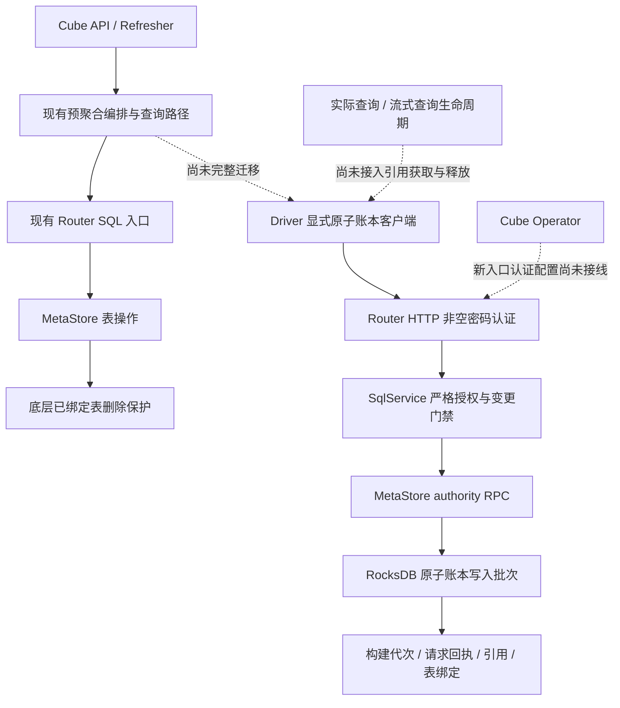

# Router HA 原子预聚合账本进展：2026-09-08

## 结论

**生产结论仍为 `NO-GO`。本次不是全部整改完成，也没有部署或切主验收。**

本轮新增 MetaStore 原子账本、受认证的 Router HTTP 桥接和显式 Driver 客户端。Rust 非测试目标编译通过，Driver 测试通过；Rust 行为测试尚未执行。现有预聚合与实际查询生命周期没有完整迁移到新协议，不能将本次改动描述为“生产写入一致性已闭环”。

没有新增 Redis、PostgreSQL 或 Raft 依赖。没有操作现有 Kubernetes 集群、删除数据、修改持久卷、提交或推送代码。

## 本次代码变更

| 范围 | 新增实现 | 验证边界 |
| --- | --- | --- |
| MetaStore 账本 | 独立的构建、当前代次、请求回执、引用和表绑定记录；代次由服务端生成 | 非测试目标编译通过，行为测试未执行 |
| 原子变更 | 领取、续约、绑定、发布、获取/释放引用、退休及删除，通过 MetaStore 写入批次处理 | 不能替代真实并发与故障测试 |
| 请求幂等 | 同一请求 ID 记录成功或业务拒绝结果；不同载荷复用 ID 被拒绝 | Driver 协议测试通过，服务端持久性测试未执行 |
| 删除保护 | 在底层表删除入口检查账本绑定；账本删除要求退休且无引用 | 实际查询尚未完整登记引用，不能声明自动回收安全 |
| Router 桥接 | `GET/POST /router/pre-aggregation-ledger` 经 SqlService 转入 MetaStore RPC | 要求严格授权和非空密码认证；默认无密码认证会被拒绝 |
| Driver | `getAtomicPreAggregationLedger()` 提供显式读取与变更；数值以十进制字符串传输 | 现有预聚合编排没有因此自动切换到新协议 |
| 不确定结果 | 不自动重放变更，不回退到旧 CACHE 标记；异常响应不能当作恢复成功 | 查询记录不存在也不能证明旧 SQL 没有产生效果 |

主要源码：

- `rust/cubestore/cubestore/src/metastore/pre_aggregation_ledger.rs`
- `rust/cubestore/cubestore/src/metastore/pre_aggregation_ledger_tests.rs`
- `rust/cubestore/cubestore/src/metastore/mod.rs`
- `rust/cubestore/cubestore/src/metastore/rocks_store.rs`
- `rust/cubestore/cubestore/src/metastore/rocks_table.rs`
- `rust/cubestore/cubestore/src/http/ledger.rs`
- `rust/cubestore/cubestore/src/http/mod.rs`
- `rust/cubestore/cubestore/src/sql/mod.rs`
- `packages/cubejs-cubestore-driver/src/AtomicPreAggregationLedger.ts`
- `packages/cubejs-cubestore-driver/src/CubeStoreDriver.ts`
- `packages/cubejs-cubestore-driver/test/AtomicPreAggregationLedger.test.ts`

## 已实现入口与未接入的业务链路

实线表示本次代码中已有路径，不代表已经在 Kubernetes 运行通过。虚线是未完成集成，不能在部署图中画成已交付链路。

## 本轮实际验证

| 检查 | 实际结果 | 可以证明什么 |
| --- | --- | --- |
| Driver 新协议与原恢复回归 | **53/53 PASS**，2 个测试套件，Jest 2.596 秒 | TypeScript 客户端及原恢复单测通过 |
| Driver `tsc --noEmit` | **PASS**，退出码 0 | 类型检查通过 |
| Rust lib/bins check，第 1 轮 | 600 秒超时，退出码 124 | 仅完成部分依赖构建，无源码结论 |
| Rust lib/bins check，第 2 轮 | **PASS**，9 分 54 秒，退出码 0 | 新账本和 HTTP/SqlService 非测试目标编译通过 |
| Rust 账本测试阶段 | 600 秒超时，退出码 124，仍在依赖编译 | **没有执行测试用例**，不是测试通过，也不是用例断言失败 |
| Rust HTTP / authority 回归 | **未运行** | 无本轮行为证据 |
| 新镜像 / Kubernetes / Cube API 切主 E2E | **未运行** | 无本轮部署、恢复时间或数据一致性证据 |

Rust 使用 `nightly-2025-08-01`、`--locked --offline -j1`。第二轮 check 复用第一轮生成的构建缓存，没有改变编译参数。测试阶段尚未生成可运行的测试二进制。Rust 行为验收状态为 `evidence_incomplete`；历史版本的测试不能替代本次验证。

归档日志：

- [Driver 53 项测试](artifacts/atomic-ledger-20260908/driver-tests.log)
- [Driver 类型检查](artifacts/atomic-ledger-20260908/driver-types.log)
- [Rust 第 1 轮 check](artifacts/atomic-ledger-20260908/rust-check-pass1.log)
- [Rust 第 2 轮 check](artifacts/atomic-ledger-20260908/rust-check-pass2.log)
- [Rust 测试构建阶段](artifacts/atomic-ledger-20260908/rust-tests.log)

## 仍需完成的生产门禁

| 优先级 | 未完成工作 | 放行证据 |
| --- | --- | --- |
| P0 | 完成 Rust 测试构建，执行账本、HTTP 认证和 authority 回归 | 并发领取、旧代次拒绝、发布/退休、引用/退休竞争、真实数据库重开等用例结果 |
| P0 | 将真实预聚合领取、CREATE、绑定和结果发布接入账本 | 消除创建与绑定窗口中的恢复歧义；不能只新增一个未被编排调用的客户端 |
| P0 | 接入实际查询和流式查询的引用生命周期 | 后台刷新、排队、取消、超时、流结束、进程退出均有安全处理；使用中不能删表 |
| P0 | 完善 UNKNOWN 对账和崩溃后的引用治理 | 不凭超时或一次“表不存在”盲目重建；不能靠引用 TTL 强制释放仍在使用的数据 |
| P0 | Operator 配置新入口认证并完成 strict authority 部署接线 | 默认无密码服务不能直接使用新入口；真实 Token/TLS/RBAC 链路验收 |
| P0 | 统一版本镜像的 Cube API 与 Refresher 故障 E2E | 切主前后真实预聚合数据、表身份、构建代次和请求结果对账 |
| P0 | 旧主暂停、断网、Lease 失效、快照/授权记录恢复验收 | 旧执行者不能恢复写入或发布；恢复失败时拒绝写入 |
| P1 | 请求回执安全回收、性能、监控、升级回滚、多节点容灾 | 有保留边界、负载数据及实际多节点恢复证据，而非单节点 Pod 切换结果 |

**短暂不可用可以作为故障切换策略；它不能代替旧执行者隔离、发布一致性与数据回收保护。**
