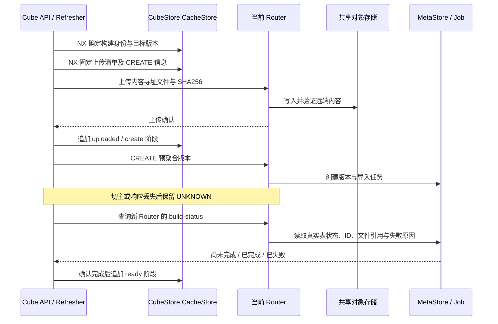
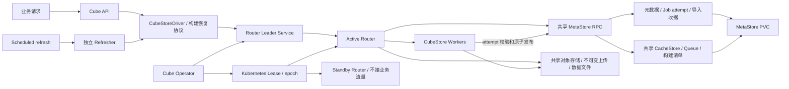
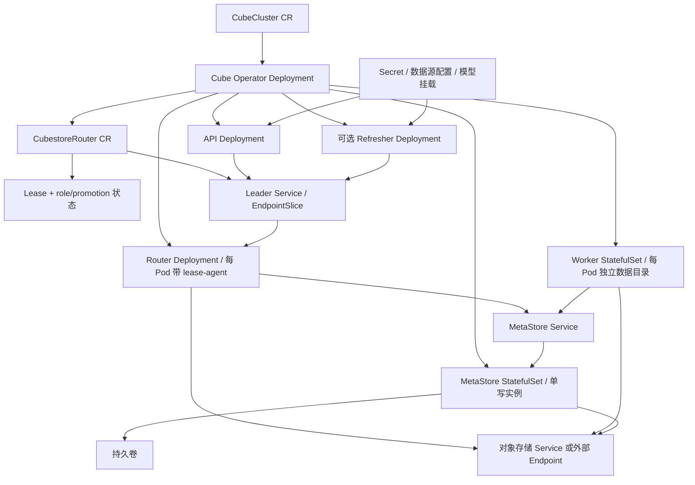
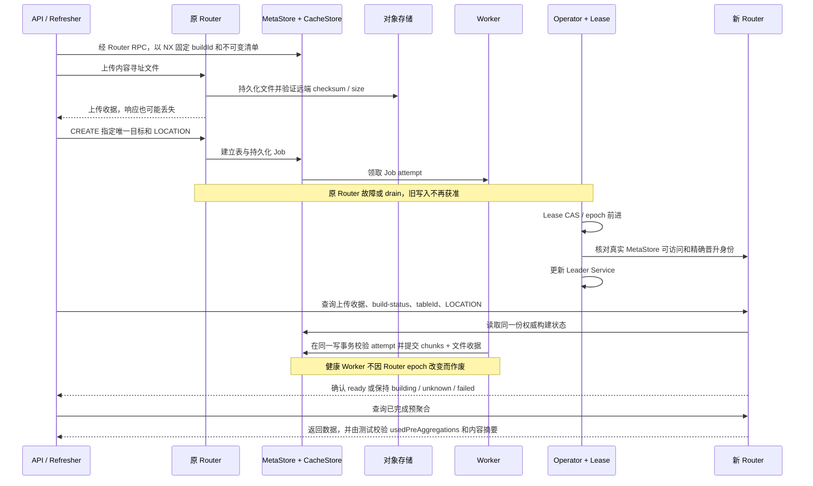

# Router HA 与预聚合恢复修复记录

日期：2026-09-07。目标分支：`codex/ha-router-experiment`。

本轮目标是修复部署、就绪判定、上传恢复、预聚合结果对账、Job 执行所有权和故障验收中的缺口。
Kubernetes Lease 继续负责 Router 选主；业务构建状态使用既有 CubeStore MetaStore/CacheStore 和对象存储，不增加 Redis 或 PostgreSQL 的强制依赖。

## 验收对象

| 编号 | 问题 | 修复应满足的行为 | 必需证据 |
|---|---|---|---|
| R1 | Router/MetaStore 未接入 Worker 拓扑与共享存储 | 各进程使用相同 Worker 地址与对象存储配置 | 渲染测试、实际部署配置、真实导入 |
| R2 | metaStoreReady 来自晋升标记默认值 | 必须执行有超时的真实 MetaStore 读取；健康 follower 可成为候选 | MetaStore 故障/恢复测试、候选晋升 |
| R3 | pre-agg 把 UNKNOWN 当作普通失败 | 持久化构建身份，查询目标版本实际状态；禁止盲重放写入 | 成功响应丢失、重入对账测试 |
| R4 | 上传中断无恢复凭据 | 内容寻址、校验远端内容、查询上传状态后恢复 | 过期本地缓存、上传中断、响应丢失 |
| R5 | 旧 Job 执行者仍可提交 | 独立 Job 执行令牌；最终可见性提交中校验所有权 | 旧执行者心跳/提交拒绝、任务重领 |
| R6 | 顶层 Running 掩盖恢复缺口 | 逐组件判定副本和 generation，区分业务恢复与入口就绪 | 缺失子资源、滚动副本、恢复条件测试 |
| R7 | 启动扫描/Secret/退出加固不完整 | 标准工作队列调谐，可打印 Secret 与轮换，真实排空及 SIGTERM | 重启、Secret 变化、drain/停机测试 |
| R8 | CR 无法表达完整 Cube 部署 | 支持数据源配置、模型挂载、资源/存储类、独立 refresher | CRD/控制器一致性及渲染测试 |
| R9 | 只验证已存在数据 | 实际 Cube API rollup 构建中故障注入，并确认使用预聚合 | 故障屏障、结果校验、构建与切主任期证据 |

## 状态与数据归属

| 数据 | 权威介质 | 切换要求 |
|---|---|---|
| Router holder、任期 | Kubernetes Lease | 新主必须获得有效任期并通过真实健康检查 |
| 入口角色与晋升标记 | Kubernetes API 投影 | 是派生状态，不能代替业务数据检查 |
| 预聚合构建身份与阶段 | CubeStore CacheStore | 共享 MetaStore 配置与持久卷；UNKNOWN 后读取确认 |
| 表、导入状态、Job 与执行令牌 | CubeStore MetaStore | 健康 Worker 任务不因入口切换而重做 |
| 已确认上传文件与数据文件 | 共享对象存储 | 不以 Router 本地缓存证明远端上传完成 |
| 连接与未完成 HTTP 请求 | 当前进程 | 允许中断；由构建协议恢复，不能当作持久化事实 |

## 恢复原则

1. 操作结果未知时先对账，只有确认不存在或有可验证幂等性时才能再次发送。
2. 表存在不等于导入完成；普通 INSERT 的结果不能通过表的 ready 标志推断。
3. 构建失败与网络响应丢失是不同状态。未完成对账的构建必须保留必要恢复信息。
4. 新预聚合版本完成之前，保留原来已完成的可查询版本。
5. Router 任期和 Job 执行身份分离；接管入口不意味着取消健康 Worker 的任务。
6. 最终提交必须在权威状态更新中检查 Job 所有权，不能只有客户端检查。
7. 排空先停止接收新变更，再等待已接受操作完成；不能用固定 sleep 代替。

## 验证环境

使用本地 `orbstack` 的隔离命名空间 `cube-ha-remediation`。旧 `cube-operator-demo` 的 PVC 和数据保留。
单节点环境可以验证 Pod 故障与协议行为，不能提供多物理节点故障域隔离的实验证据。

## 预聚合恢复协议



`PRE_AGG_BUILD_V1:<target>` 保存构建身份，`PRE_AGG_MANIFEST_V1:<target>` 保存通过 NX 固定的输入清单。
`PRE_AGG_PHASE_V1:<target>:<phase>` 追加阶段记录，避免迟到写入把已完成构建覆盖成旧阶段。
恢复流程校验目标表 ID 和预期文件引用。普通 INSERT 仍不能因为目标表存在而直接重放。

Job 使用独立的执行令牌。Worker 的数据发布应与令牌校验处于同一次 MetaStore 写操作中；
重新领取的任务不能接受旧执行者的提交。该协议不把 Kubernetes Lease 与对象存储写入描述成跨系统原子事务。

## 集成中额外修复的真实缺陷

| 缺陷 | 修复 | 验收依据 |
|---|---|---|
| 远程 MetaStore 模式下 CacheStore 注入 panic 占位实现 | CACHE/QUEUE 复用 MetaStore 连接，通过真实 CacheStore RPC 访问同一权威实例 | 真实 RocksCacheStore、序列化 RPC、NX 竞争与替换客户端测试；继续由 K8s 业务请求验收 |
| CacheStore scheduler 启动条件互相矛盾，首次写入出现 `SendError(Insert(CacheItems, 1))` | 按本地权威 CacheStore 的存在启动和关闭 scheduler，不在 remote-only Router 上实例化本地 scheduler | 原失败测试不加假 listener，修复后通过 |
| 无 TTL 的恢复清单仍会被普通缓存淘汰 | 五类 `PRE_AGG_*_V1:` 记录排除自动 eviction/TTL/compaction，保留显式删除 | 六种淘汰策略、TTL/索引、显式删除测试通过 |
| 远程 Router 查询 `information_schema.schemata` 调用同步本地表接口并 panic | schema/chunk/partition/index 元数据查询改用异步 RPC，保留查询列和含义 | 真实 API 请求暴露；增加本地与远端 SQL 结果对照测试 |
| 独立 Refresher 模式中 API 不负责构建，却被要求声明调度能力 | API 仍须 generation 和应用就绪；构建调度能力由 Refresher 提供，Router 恢复条件不放松 | Go 角色组合测试 |
| 恢复路径把切主连接错误写入队列终态，阻止后续恢复 | 仅有持久化 buildId 的预聚合将连接错误归为 UNKNOWN，保留 touch，并允许按原清单恢复；普通 SQL 不获得重放权限 | 定向 Loader/QueryQueue 回归；真实故障轮询继续核对原身份 |
| 原 API `/livez` 检查后端，切主时超时触发 API 重启 | 新增无后端访问的 `/livez/process`；HA 部署的 API/Refresher 默认 startup/liveness 使用新路径，readiness 仍为 `/readyz` | 实际事件中原探针超时 9 次、API 重启 3 次；新增 Express 与 Go 测试，后续实测核对重启计数 |
| 预期晋升等待返回 error，导致框架忽略显式重试间隔 | `errPromotionPending` 返回固定 5 秒重排队且不返回错误；真实后端错误仍报错 | 先复现后修复，覆盖多轮 marker/EndpointSlice 等待与最终收敛 |

`/livez/process` 是本次定制 API 镜像新增接口，旧 `/livez` 和 `/readyz` 的对外语义保持兼容。非 HA 部署默认不切换路径；不能假定未升级的官方 API 镜像已经提供此接口。显式自定义 probe 仍由用户负责其语义。

本轮允许切主时短暂不可用，不把“所有 HTTP 请求零错误”作为承诺。演示只对白名单连接/主备切换错误及 502/503 对同一个 `/load` 请求做有界重试，逐次记录不可用事件；普通 SQL 错误、权限错误和任意未识别的 400 仍立即失败。INSERT 不自动重试，构建身份、文件清单和结果摘要的断言不放宽。

恢复记录保护不是无限存储承诺：终态记录当前不自动 GC，必须监控 CacheStore/PVC 容量。不能为了降容量而给幂等身份随意加 TTL。显式 `CACHE REMOVE`、清空 CacheStore 或删除 PVC 会破坏恢复依据，不属于安全切主操作。

## 逻辑架构



这里的共享是多个 Router 访问同一个权威 MetaStore/CacheStore 服务，不是多个 RocksDB 进程同时挂载并写同一目录。Kubernetes Lease 管主备身份，业务状态由 CubeStore 自身存储，未强制引入 Redis/PostgreSQL。

## K8s 部署关系



本轮隔离验证使用 `cube-ha-remediation` 命名空间，旧 `cube-operator-demo` 的工作负载和 PVC 不作为修复目标。演示对象存储使用该隔离命名空间内的 MinIO；生产可以使用已有兼容对象存储。单节点 `local-path` 卷只能用于本地演示，不能据此宣称跨节点存储容灾通过。

## 请求与切主的数据流



独立 Refresher 演示是“真实 scheduled refresh 构建，API 消费完成后的 rollup”，不能描述为“只要使用共享 Queue，API 的每项构建就必然由 Refresher 消费”。普通查询的连接上下文仍是内存态，连接中断需要有界重试；任意非幂等 SQL 不因增加 Lease、PVC 或缓存清单而获得 exactly-once。

## 升级与证据边界

- 新 Job attempt、CacheStore 和元数据 RPC 需要匹配版本的 Router、Worker、MetaStore；第一次迁移必须停止新构建并排空旧 Worker，不能让旧 raw append 协议继续写入。
- 组件升级顺序校验 MetaStore、Worker、Router、API 的 generation、revision 和应用探针，不能用副本数相加代替就绪判断。
- Router 切主复用存活的共享 MetaStore/PVC，与 MetaStore 自身崩溃恢复、整机掉电、卷丢失是不同故障模型。异步远端日志和快照不等于跨节点同步提交。
- `ProductionReady` 不因单元测试、进程 Ready 或一次切主被强行置为 True；必须按生产存储、容量、故障域和业务验收补齐运行证据。

## 本轮结果

六项真实 K8s 场景已分批通过。报告日期为北京时间 2026-09-07，原始日志使用 UTC。不是一次无失败运行：中间失败及最终成功证据分别保留，不能把原失败改判为成功。

### 业务验收矩阵

每项使用独立 run、4096 行真实 CubeStore 源数据和 16 行 Cube API 分组结果。共同断言包括：实际 SELECT 命中精确构建表、external=true、预期/实际结果哈希相同、不可变上传 manifest、远端 receipt、LOCATION 一致、权威状态与持久化 manifest 均 ready、匹配且持久化的 tableId。

| 场景 | run | 屏障到新主接流量 | 查询瞬态错误到成功 | tableId | 结果 |
|---|---|---:|---:|---:|---|
| rows 导出、上传中切主 | `r14bc37b4bfa7e982` | 31.497 s | 45.857 s | 14 | PASS |
| 远端上传成功，仅丢回执，不切主 | `rf07dd05657f38faa` | 不适用 | 20.931 s | 16 | PASS |
| 远端上传成功、丢回执并切主 | `r881fce58f7d219a2` | 35.669 s | 56.302 s | 18 | PASS |
| drain、旧连接拒写、真正排空再切主 | `ra552a74642ac663f` | 33.251 s，含 drain | 33.264 s | 24 | PASS |
| stream 文件导出上传中切主 | `r2eaadaa775662174` | 35.133 s | 36.418 s | 26 | PASS |
| 独立 Refresher 构建中切主、API 随后消费 | `rf8f47788f4d404f8` | 31.686 s | 不适用：恢复后才发 API 请求 | 29 | PASS |

接流量要求 leader 变化、epoch 增大、唯一 Ready EndpointSlice 和 promotion 确认。计时来自 fault_ready/fault_released/apiAvailability，不是压力测试 P95/P99 或 SLA。查询恢复时间还包含构建及有界重试。Refresher 的 API 错误计数为 0，不证明切主期间零不可用，因为当时尚未发 API 查询。

原预算未延长：每 run 300 s、切主观测 45 s、单次上传 POST 60 s、CREATE 协调默认 120 s、API 瞬态重试 120 s 并受总 deadline 限制。最后 scheduled 场景发生一次只读观察连接错误，35.792 s 后恢复，保留了完整错误和恢复事件。

[机器可读汇总](demo/k8s/evidence/2026-09-07/acceptance-summary.json)；[原始证据与日志索引](demo/k8s/evidence/2026-09-07/README.md)。passed/ 为成功原始事件，diagnostics/ 为失败过程，不能混用。

### 数据对账

最后的独立 Refresher 场景还用真实 SQL 分别检查源表和产出预聚合表：

| 指标 | 源表 | 产出表 | 结论 |
|---|---:|---:|---|
| 对应源数据行数 | 4096 | SUM(row_count)=4096 | 一致 |
| 金额合计 | 142653440 | 142653440 | 一致 |
| ID 平方校验和 | 22914881536 | 22914881536 | 一致 |
| 产出表物理行数 | 不适用 | 4096 | 按 ID 粒度保留 |
| API 分组结果行数 | 预期 16 | 实际 16 | 一致 |

结果 SHA256：`c569eed4651ca9cea03548f000af05fa6872aec54d22a50dc01ca5f04909e644`，预期与实际相同。表为 `ha_rf8f47788f4d404f8_rollups.router_ha_rollup_by_id_jznx5i3p_0nbiitxl_1l9rh22`，权威 tableId=29，manifest 同样保存 29，不是发现同名表就当作恢复。

[SQL 对账原始结果](demo/k8s/evidence/2026-09-07/runtime/data-reconciliation.json)。各 run 的完整哈希分别保存，不混用跨 run 数据。

### 最后确认并修复的缺口

| 问题 | 真实证据 | 最终处理 |
|---|---|---|
| ConfigMap 投射仍在切主关键路径 | 曾在 Lease 获得后约 85 s 才 serving；promotion 文件明显落后于直读 API 的 leadership 文件 | agent 每 2 s 直读指定 ConfigMap，单轮整体 2 s deadline，前后 Lease 身份一致后原子写本地文件；失联、过期、失配和退出同时关闭两个输入 |
| 物理表 ready，但 ledger 停在 create | API 已返回，约 103 s 后仍缺 ready/tableId marker | Driver 表发现路径必须核对 immutable manifest、权威 LOCATION/tableId，持久化并确认 ready 后才发布；失败则拒绝发布 |
| 多 context 的能力检查直接返回空值 | Refresher 实际配置正确，但 non-standalone 被提前排除 | 检查实际 default-context Orchestrator，不按 standalone 短路；不推断所有租户都支持恢复 |
| drain 测试持有上传屏障又同步等排空 | 约 25 s 后 503，形成测试等待环 | 异步 drain、证明拒写、结束旧 upstream、真正排空后切主；CLI 0 和独立 POST drained=true/inFlight=0 均必须成立 |
| 服务端拒写被误要求为 QueryError | Driver 将 HttpError/WrongConnection 映射为 ConnectionError | 保存原 WS 请求/响应帧及 messageId/SQL；匹配精确 drain 拒绝，断连或超时不能当 fencing |
| 生产隐藏调试字段，外部读取默认 skip-queue | usedPreAggregations 缺失；成功读取无 processingId | 不开 dev mode；验证真实 SQL 开始、精确表名和完成日志，明确 skip-queue，不伪装获取共享查询锁 |
| 观察器遇切主读错误立即退出 | Refresher 已真实上传，但 CACHE 读收到 draining 后测试停止 | 仅明确 CACHE GET/KEYS 和状态 GET 可在原 deadline 内重试并记录；mutation、权限、SQL、身份冲突和 failed/retired 不被吞掉 |

最终仍使用 ConfigMap，但 Router 不再等待 kubelet 投射：lease-agent 经双重 Lease 校验后写内存 EmptyDir，Router 只读。30 s Lease 安全等待没有删除，也没有新增必选 Redis/PostgreSQL 或实现 Raft。

### 编译与定向回归

| 范围 | 最新实际结果 |
|---|---|
| Operator/lease-agent | go test ./...、go build ./... PASS；含 stale marker、失联、超时、Lease 变化、退出 fail-closed、RBAC、rollout/probe |
| CubeStoreDriver | TypeScript 编译 PASS；恢复回归 34/34 |
| Query Orchestrator | TypeScript 编译 PASS；Recovery/PreAggregations/QueryQueue 59/59 |
| Server Core | TypeScript 编译 PASS；能力及 non-standalone HTTP 回归 19/19 |
| API Gateway | TypeScript 编译 PASS；process liveness + 既有健康检查 9/9 |
| Demo 纯测试 | 30/30：helper/provenance 10、proxy 7、load 6、wire 3、observer 4 |
| Rust Job/attempt/import/scheduler | 33 个独立定向测试 PASS |
| Rust HTTP/HA/upload/status/origin/CacheStore bridge | 26 个独立定向测试 PASS |
| Rust recovery cache eviction/TTL/compaction | 3/3 PASS |
| Rust remote metadata SQL/SHOW | 1/1 PASS；另重跑的 HA 4 项已计入前批，不重复累加 |

这些是分批最新定向回归，不是整仓全部测试。Server-core/Gateway Jest 使用包既有 --forceExit，不能据此排除所有异步 handle 泄漏。Rust metadata 测试经过真实 RocksStore/RPC 编解码/SQL，但不是多节点网络故障测试。

核心重跑命令（仓库根目录；先编译相应包）：

```bash
(cd operators/cube-operator && go test ./... && go build ./...)
yarn workspace @cubejs-backend/cubestore-driver tsc --pretty false
yarn workspace @cubejs-backend/query-orchestrator tsc --pretty false
yarn workspace @cubejs-backend/server-core tsc --pretty false
yarn workspace @cubejs-backend/api-gateway tsc --pretty false
yarn jest --config packages/cubejs-cubestore-driver/jest.config.js --runInBand --coverage=false --runTestsByPath packages/cubejs-cubestore-driver/dist/test/PreAggregationRecovery.test.js
yarn jest --config packages/cubejs-query-orchestrator/jest.config.js --runInBand --coverage=false --silent --runTestsByPath packages/cubejs-query-orchestrator/test/unit/PreAggregationRecovery.test.ts packages/cubejs-query-orchestrator/test/unit/PreAggregations.test.ts packages/cubejs-query-orchestrator/test/unit/QueryQueue.test.ts
yarn jest --config packages/cubejs-server-core/jest.config.js --runInBand --forceExit --coverage=false --runTestsByPath packages/cubejs-server-core/dist/test/recoveryCapabilities.test.js
yarn jest --config packages/cubejs-api-gateway/jest.config.js --runInBand --forceExit --coverage=false --silent --runTestsByPath packages/cubejs-api-gateway/dist/test/process-liveness.test.js packages/cubejs-api-gateway/dist/test/index.test.js --testNamePattern 'process-only liveness|healtchecks'
```

真实 E2E 执行命令如下。按需构建和独立 Refresher 使用不同 CR 角色配置；当前集群保留独立 Refresher，不能不切角色直接重跑按需场景。准备见 [E2E 说明](demo/k8s/PREAGG-E2E.md)。运行脚本必须冻结，不与编辑同一脚本并行。

```bash
NAMESPACE=cube-ha-remediation HA_TIMEOUT_SECONDS=300 FAULT_MODES='upload-failover receipt-loss receipt-failover drain-failover' EVIDENCE_DIR=/tmp/cube-ha-preagg-acceptance-evidence bash operators/cube-operator/demo/k8s/preagg-fault-check.sh
# 原组合运行前三项成功，drain 修复后单独重跑；不改判原失败
NAMESPACE=cube-ha-remediation HA_TIMEOUT_SECONDS=300 FAULT_MODES=drain-failover EVIDENCE_DIR=/tmp/cube-ha-drain-final-evidence bash operators/cube-operator/demo/k8s/preagg-fault-check.sh
NAMESPACE=cube-ha-remediation HA_TIMEOUT_SECONDS=300 HA_TRANSFER=stream FAULT_MODES=upload-failover EVIDENCE_DIR=/tmp/cube-ha-stream-final-evidence bash operators/cube-operator/demo/k8s/preagg-fault-check.sh
# 切到独立 Refresher 的 CR 后
NAMESPACE=cube-ha-remediation HA_TIMEOUT_SECONDS=300 EVIDENCE_DIR=/tmp/cube-ha-refresher-observed-evidence bash operators/cube-operator/demo/k8s/refresher-fault-check.sh
```

### 最终部署与镜像

本地 orbstack、namespace=cube-ha-remediation、单 ARM64 节点。CubeCluster generation/observedGeneration=11，phase=Running，7/7 Cube 工作负载 Pod Ready，最终 Router epoch=20。当前 API、Refresher、MetaStore、Worker、Router 容器重启数均为 0。镜像更新和故障注入替换旧 Pod，不等于同一容器 restart。

| 镜像 | 用途 | 本地 image SHA256 |
|---|---|---|
| cube-operator:ha-remediation-20260907-cutover | manager + lease-agent | `8edd49c362235bff66cd80a39159cc1f4ba8ed54ad063f83f2b05136fdb45b69` |
| cube-studio-router:ha-remediation-20260907-final | Router、MetaStore、Worker | `c150d9bd1c091035cf07de8bd70efeda3d506cacd20a0b256dc373df9c30355f` |
| cube-studio-api:ha-remediation-20260907-refresher | 最终 API + Refresher | `93e4da2a3f7683e0ebfca054b8bb4b9a76e6e0003d2ec67ba171cc25e4eb47ec` |

全部实际构建成功，Linux ARM64。前三项使用 publication API 镜像；drain/stream 使用 drain 镜像；最后 refresher 镜像增加 default-context 能力修复。不是六项在同一镜像、同一次脚本内完成。镜像只构建到本地，Git 推送不代表镜像仓库已发布。

新 Operator 参数需配套新 lease-agent：先更新 CR spec.images.leaseAgent，再升级 manager，不能让旧 agent 解析新参数。

### 结论和未完成的生产门禁

已证明：Kubernetes 主备 Router 切换，以及升级后文件导入型预聚合在六个场景中的数据、身份、上传和发布闭环。不只是切换 Service，也没有用普通 INSERT 重放掩盖未知结果。

ProductionReady=False 按事实保留，仍未覆盖：

- 单写 MetaStore/PVC 和演示 MinIO 的整机掉电、永久丢盘、网络分区、跨节点/可用区恢复及备份还原；异步 Snapshot/Log 不等于这些场景 RPO=0。
- 任意 INSERT/DDL、外部非幂等写、持续流式导入的 exactly-once；本轮 stream 只是文件流导出，不是 Kafka 等持续流。
- Refresher 自身崩溃后所有工作恢复、所有 scheduler 的单主共识；default-context 能力及一个真实 scheduled context 不证明全部租户/数据源。
- 自动终态恢复记录 GC。防 eviction/TTL 已完成，但需容量告警和受控治理；显式 remove/wipe 仍会删除协议状态，不能给活跃记录随意加 TTL。
- 长期压力、完整故障矩阵及版本混部生产演练；首次升级必须排空旧 Worker 并统一新增 Job/metadata RPC 协议。

未通过改 condition、延长预算或改写失败记录隐藏边界。上线审批应使用以上范围和原始证据，而不是将 workload Ready 当作全系统生产 GO。
