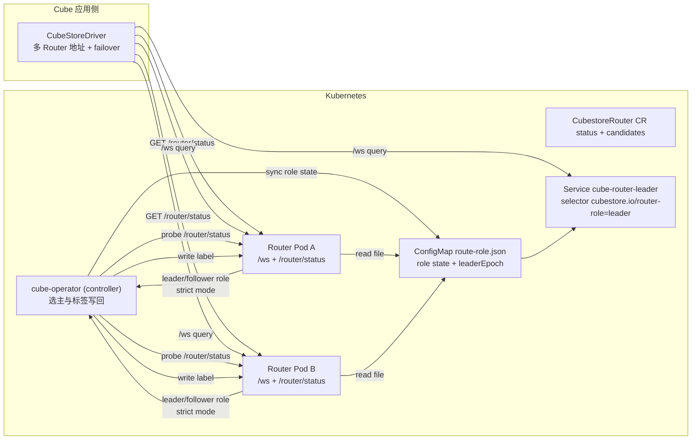
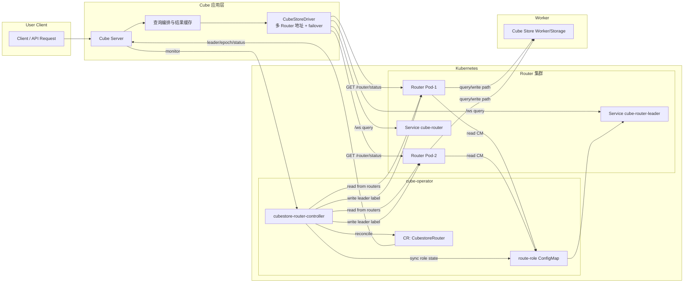

# Cube Router HA 架构（实验）



## 当前实现边界（生产注意）

- 路由层请求入口（`query`/`upload`）通过 leader/follower gate 与 `leaderEpoch` 做高可用路由。
- 运行时内存状态（缓存、上传 temp、队列处理上下文）仍主要在 pod 本地；切主后会有瞬时重复/偏差风险。
- 未实现分布式幂等键与写事务重放协议；非幂等 SQL 的重试由客户端侧 `retryable` 控制。
- 建议把本架构用于主备切换高可用入口层，并配套外部幂等系统（消息 ID、事务日志、写侧去重）后再上生产。

### `/router/status` 字段约定（新增）

- `activeLeader`（顶层）：当前主节点名称（可优先使用，兼容旧版本）。
- `leaderEpoch`（顶层）：当前任期。
- `leaderState`：仍保留兼容结构，包含 `activeLeader`、`leaderEpoch`、`updatedAt`。

示例返回：

```json
{
  "node_name": "cube-router-a",
  "is_leader": true,
  "role": "leader",
  "mode": "primary",
  "activeLeader": "cube-router-a",
  "leaderEpoch": 12,
  "leaderStateSource": "file",
  "timestamp_unix_secs": 1760000000,
  "leaderState": {
    "activeLeader": "cube-router-a",
    "leaderEpoch": 12,
    "updatedAt": "2026-..."
  }
}
```

## 与 Cube 主系统结合架构


