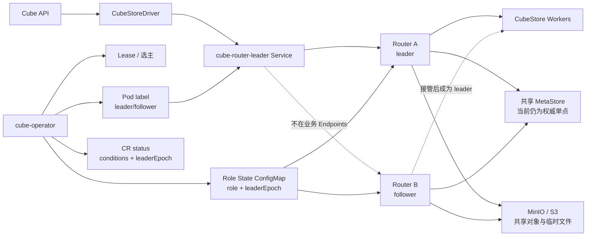
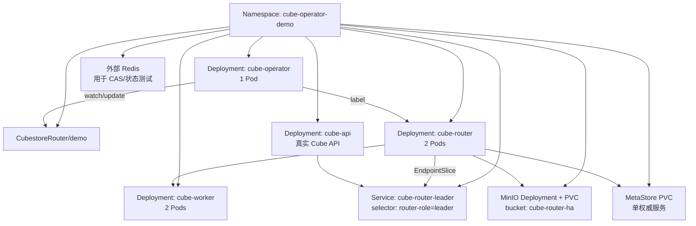
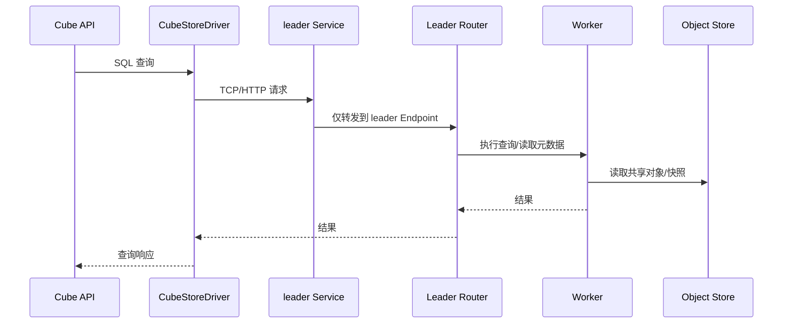
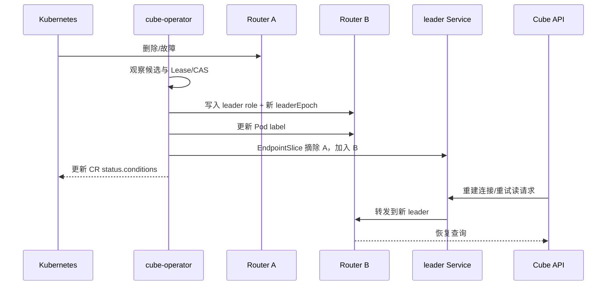

# Cube Router 主备 HA：Kubernetes 演示与验证报告

> 文档状态：2026-08-04
>
> 验证环境：本地 Kubernetes（context：`orbstack`）
>
> 结论先行：当前已经实现并验证了 **Cube API -> CubeStoreDriver -> leader Service -> Router 主备切换 -> Worker** 的单写主备 HA 演示链路。查询数据在切主前后保持一致，旧 leader 删除后可自动选出新 leader。
>
> 生产边界：当前不能宣称已经覆盖所有生产写入、Job、upload、preaggregation、Refresher 恢复场景。文末列出了仍需完成的生产化工作。

## 1. 目标与范围

本方案解决的是 Router 单实例入口故障问题：部署两个 Router，但任意时刻只允许一个 Router 进入业务 Service，另一个作为 follower 等待接管。

### 已覆盖

| 能力 | 当前结果 | 证据 |
|---|---:|---|
| 两个 Router Pod 运行 | 已验证 | 两个 Pod 均 `RESTARTS=0` |
| 单 leader 入口 | 已验证 | `cube-router-leader` Service 仅选择 leader label |
| leader/follower 角色同步 | 已实现 | Operator 写入 ConfigMap、Pod label、角色文件 |
| leaderEpoch 任期递增 | 已验证 | 最终 CR `leaderEpoch=44` |
| leader 故障切换 | 已验证 | 删除旧 leader 后选出新 leader |
| EndpointSlice 跟随切主 | 已验证 | EndpointSlice 仅保留当前 leader |
| Cube API 真实查询 | 已验证 | 真实 API 查询返回 12 行、金额 780 |
| 切主前后数据一致 | 已验证 | before/after hash 完全相同 |
| Router 共享对象存储 | 已接入演示 | MinIO bucket `cube-router-ha` |

### 尚未宣称完成

| 生产能力 | 当前状态 |
|---|---|
| 非幂等写在超时/重试/切主期间绝不重复 | 未完全闭环 |
| Job、upload、preaggregation、Refresher 的安全接管与恢复 | 未完全闭环 |
| MetaStore 自身高可用 | 当前仍为单一权威服务，需要备份/恢复与故障预案 |
| Redis/对象存储生产级故障域 HA | 演示环境已接入，生产形态仍需外部集群化 |
| 全量网络分区、存储故障、并发写压测 | 未完成 |

## 2. 当前结论

### 2.1 可以确认的结论

当前方案已经达到：

```text
Router 双 Pod
  + Operator 选主
  + ConfigMap 角色状态
  + leader Service 单写入口
  + EndpointSlice 自动摘除旧 leader
  + 共享 MinIO 对象存储
  + Cube API 真实查询切主验证
= 可运行的 Router 单写主备 HA 原型/演示版本
```

### 2.2 不能过度解读的结论

它不是“所有 CubeStore 运行时状态都已经复制”的多活集群，也不是“所有业务写入都具备 exactly-once 语义”。Router 本地连接上下文、内存缓存、执行中的请求仍可能在进程故障时丢失；生产写入必须依赖幂等键、结果查询和下游事务约束。

## 3. 逻辑架构图



关键原则：Kubernetes Service 只负责把流量发给带有 leader label 的 Pod，不负责选举；选举与 fencing 由 `cube-operator` 完成。

## 4. Kubernetes 部署图



### 当前实际镜像摘要

| 组件 | 数量 | 镜像摘要 |
|---|---:|---|
| Router | 2 | `sha256:71642434d84d80464d32aa79bf43715a6087bb84cec72e7a0f91ab56b5dbc32c` |
| cube-operator | 1 | `sha256:5db3f6f8d2e4713357b8ca0b773a0196607a75f1de7b79a29ef410fb9ed1e309` |
| Cube API | 1 | `sha256:d636f26c8830e6bf34f0ff4611ab3c0abaa93953e267382f755179ad4cdd5b8e` |
| MinIO | 1 | `sha256:14cea493d9a34af32f524e538b8346cf79f3321eff8e708c1e2960462bd8936e` |

> MinIO 当前为单 Pod + 单 PVC，仅用于演示共享持久化；生产环境应使用分布式 MinIO/S3 或等价的高可用对象存储。

## 5. 请求与切主数据流

### 5.1 正常查询



### 5.2 删除 leader 后切换



切换窗口允许短暂不可用，但必须满足两个安全条件：旧 leader 不能继续被业务 Service 选中；写请求不能在结果未知时被无条件重放。

## 6. 真实验证结果

### 6.1 Cube API 端到端切主验证

执行入口：

```bash
cd /Users/xujiawei/magic/workbench/cube
bash operators/cube-operator/demo/k8s/cube-api-failover-check.sh
```

真实链路为：

```text
Cube API -> CubeStoreDriver -> cube-router-leader Service -> Router -> Worker
```

结果：

```text
Cube API before: rows=12 amount=780 concrete_row_id=7 hash=2ec29e4ff1a8a777a8381411d5dd8706a4e04f324fc00a8a2ece4371333c3b9c
pod "cube-router-demo-74598d948f-gh9rg" deleted
Cube API after: rows=12 amount=780 concrete_row_id=7 hash=2ec29e4ff1a8a777a8381411d5dd8706a4e04f324fc00a8a2ece4371333c3b9c
PASS: Cube API real-data rows, concrete row, grouped aggregate and query result preserved
```

| 指标 | 切主前 | 切主后 | 结论 |
|---|---:|---:|---|
| 返回行数 | 12 | 12 | 一致 |
| 金额聚合 | 780 | 780 | 一致 |
| 具体行 ID | 7 | 7 | 一致 |
| 结果 hash | `2ec29e...3c9b9c` | `2ec29e...3c9b9c` | 完全一致 |
| 业务入口 | leader Service | leader Service | 入口不变 |

### 6.2 控制面状态

最终观察到：

| 观察项 | 结果 |
|---|---|
| 当前 leader | `cube-router-demo-74598d948f-492nz` |
| `leaderEpoch` | `44` |
| Router Pod 数 | 2 |
| Worker Pod 数 | 2 |
| Router 重启次数 | 两个 Pod 均为 `0` |
| EndpointSlice | 仅当前 leader，`ready=true` |
| 近 10 分钟 Router 错误 | 未发现 `OOM`、对象缺失、损坏或 `ERROR` |

CR status 已包含以下状态条件：

```text
LeaderElection
RoleStateSync
JobRecovery
MutationReconcile
PromotionReady
RefresherReady
```

其中 `JobRecovery`、`MutationReconcile`、`RefresherReady` 仍可能报告阻塞或需要业务上下文，这不是演示失败，而是生产恢复能力尚未全部实现的明确标记。

### 6.3 自动化测试结果

| 测试 | 结果 | 说明 |
|---|---:|---|
| `go test ./...` | PASS | Operator/Go 组件通过 |
| 真实 Redis `go test ./internal/leadership` | PASS | 使用外部 Redis CAS 验证 |
| `cargo test -p cubestore http::tests --lib` | 9 PASS | Router HTTP 相关测试 |
| Router 远程 MetaStore 配置测试 | 1 PASS | focused test |
| `cargo test -p cubestore --lib` | 317 PASS / 2 FAIL | 仍有时序清理与 SQL explain 测试失败 |
| Cube API 真实数据切主 | PASS | before/after hash 一致 |

完整 Rust 测试的两个失败项：

1. `metastore::tests::delete_old_snapshots`：快照清理断言存在时序敏感性。
2. `sql::tests::explain_analyze_detailed`：Router 场景出现 `channel closed`。

因此当前结论必须写成“核心 HA 与真实 API E2E 已通过，完整 Rust 回归尚未全绿”。

## 7. 已实现的代码修改

### 7.1 cube-operator

- 通过 `CubestoreRouter` CR 管理 Router 候选集合与期望副本数。
- 使用 Lease/CAS 竞争避免多个 Router 同时成为 leader。
- 将角色、任期 `leaderEpoch` 写入 Role State ConfigMap。
- 将 `leader/follower` 写入 Pod label，交由 Service/EndpointSlice 完成流量摘除。
- 将角色状态写入 Router 可读取的 promotion/role 文件。
- 持续更新 `CR.status.conditions`，报告选举、角色同步、晋升准备和恢复能力状态。
- 通过 APIReader 读取最新 ConfigMap，避免缓存版本过旧导致 `resourceVersion` 冲突。

### 7.2 Router/CubeStore

- Router 以严格角色模式运行，follower 不作为业务主入口。
- Router 使用共享对象存储配置，避免把唯一业务文件只放在单个 Router 本地目录。
- CacheStore Scheduler 只在 Worker 启动，避免 Router 使用远程 MetaStore 时启动不适用的本地调度逻辑。
- Router/Driver 的重试策略区分读请求与带 `mutationId` 的幂等写请求。

### 7.3 演示环境

- 增加 MinIO Secret、PVC、Service、Deployment 和初始化 bucket Job。
- Router 与 Worker 共享 `cube-router-ha` bucket 和统一 subpath。
- Cube API 使用固定 demo schema，保证真实端到端查询可重复。
- E2E 脚本在删除 leader 前先保存完整结果快照，切主后比较行数、聚合、具体行和 hash。

## 8. 生产化差距与补齐任务

### P0：写入一致性

1. 为每个业务写请求强制生成全局唯一 `mutationId`。
2. 在持久化介质中保存 `mutationId -> state/result`，状态至少包括 `PENDING`、`COMMITTED`、`FAILED`、`UNKNOWN`。
3. 客户端遇到超时只能进入结果查询，不允许直接重新执行未知结果的写请求。
4. 对象发布、MetaStore 引用更新、去重记录建立可恢复的提交顺序和补偿流程。
5. 用并发写、超时、重复提交、切主、Redis 短暂不可用覆盖回归矩阵。

### P0：任务接管

1. 为 Job、upload、preaggregation、Refresher 增加 owner epoch/fencing token。
2. 旧 leader 失去任期后必须停止创建新任务并拒绝提交结果。
3. 新 leader 启动时扫描 `PENDING/UNKNOWN`，按任务类型执行恢复、重试或人工介入。
4. 为每类任务提供可观测的恢复状态和幂等 completion API。

### P1：依赖高可用

1. MetaStore 增加备份、恢复演练、RPO/RTO 指标；当前 RWO PVC 仍是单点。
2. Redis 从单实例升级为 Sentinel/Cluster，并验证 CAS 在主从切换期间的语义。
3. MinIO 从单 Pod/PVC 升级为分布式或接入生产 S3，开启版本控制、备份和校验策略。

### P1：故障测试与安全

1. 增加网络分区、Redis 故障、对象存储故障、MetaStore 故障和 API 重试测试。
2. 增加切换耗时、无 leader 时长、请求失败率、重复 mutation 数量等指标和告警。
3. 生产部署补齐 TLS、NetworkPolicy、Secret 管理、资源配额、PDB、备份和回滚预案。

## 9. 演示操作

### 9.1 部署

```bash
cd /Users/xujiawei/magic/workbench/cube
bash operators/cube-operator/demo/k8s/run.sh
```

### 9.2 查看角色和 Service

```bash
kubectl -n cube-operator-demo get pod -l app=cube-router --show-labels
kubectl -n cube-operator-demo get cubestorerouter demo -o yaml
kubectl -n cube-operator-demo get endpointslice -l kubernetes.io/service-name=cube-router-leader -o wide
kubectl -n cube-operator-demo logs deploy/cube-operator --tail=100
```

### 9.3 执行真实 Cube API 切主验证

```bash
cd /Users/xujiawei/magic/workbench/cube
bash operators/cube-operator/demo/k8s/cube-api-failover-check.sh
```

### 9.4 观察切换日志

```bash
kubectl -n cube-operator-demo logs deploy/cube-operator -f
kubectl -n cube-operator-demo get pod -l app=cube-router -w --show-labels
kubectl -n cube-operator-demo get endpointslice -l kubernetes.io/service-name=cube-router-leader -w
```

## 10. 文件入口

| 文件 | 用途 |
|---|---|
| `/Users/xujiawei/magic/workbench/cube/operators/cube-operator/controllers/cubestore_router_controller.go` | Router CR reconcile、角色同步、状态更新 |
| `/Users/xujiawei/magic/workbench/cube/operators/cube-operator/controllers/election_controller.go` | 选主/任期相关逻辑 |
| `/Users/xujiawei/magic/workbench/cube/operators/cube-operator/demo/k8s/run.sh` | 构建依赖的 K8s 演示部署 |
| `/Users/xujiawei/magic/workbench/cube/operators/cube-operator/demo/k8s/minio.yaml` | 演示共享对象存储 |
| `/Users/xujiawei/magic/workbench/cube/operators/cube-operator/demo/k8s/cube-api-failover-check.sh` | Cube API 真实查询与切主回归 |
| `/Users/xujiawei/magic/workbench/cube/operators/cube-operator/demo/cube-api/schema/cubes/RouterHaProbe.js` | 固定演示数据模型 |

## 11. 汇报用一句话

> 我们已经把 Cube Router 做成了 Kubernetes 上的单写主备：Operator 负责选主和任期，Service 只暴露 leader，两个 Router 共享对象存储；真实 Cube API 在删除 leader 后切换到新 leader，切换前后 12 行数据、金额 780 和结果 hash 全部一致。但生产发布前还必须补齐非幂等写恢复、任务接管、MetaStore/Redis/对象存储高可用以及完整故障回归。
