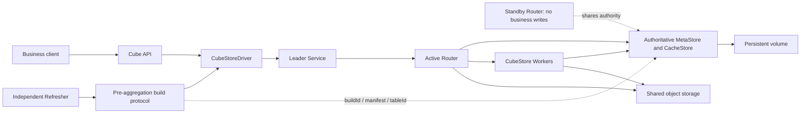
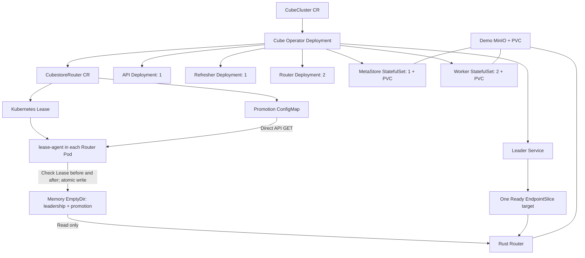
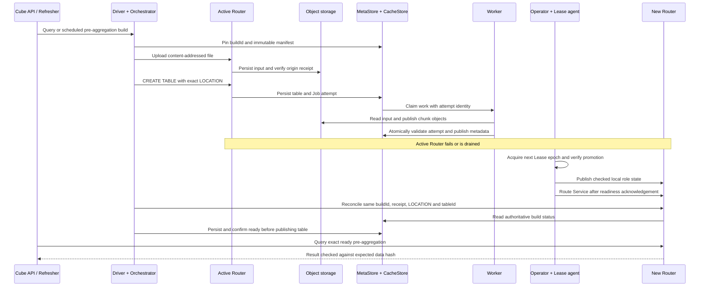
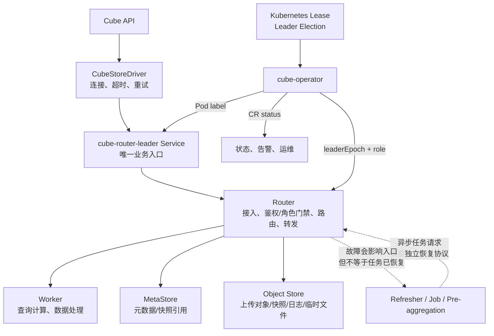
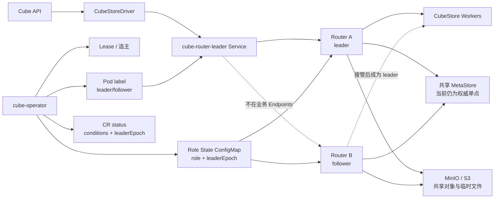
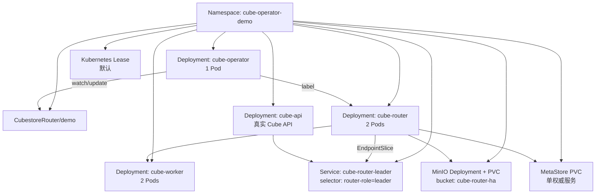
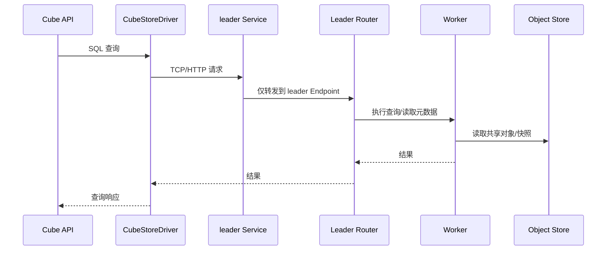
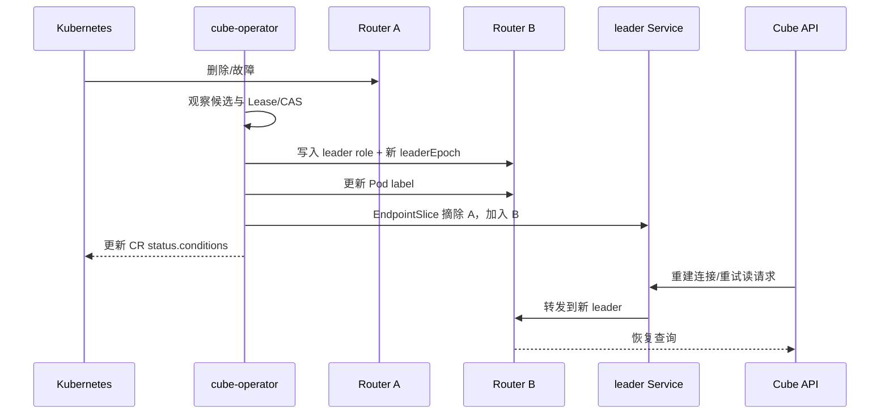

# Cube Router 主备 HA：Kubernetes 演示与验证报告

## 12 项收尾工作最新状态：仍未全部完成

本次在 `87020e400f` 之后继续修改，当前为未提交工作区，不能作为生产发布。详见 [12 项逐项记录](HA-CLOSURE-2026-09-07.md) 和 [本次原始证据](demo/k8s/evidence/2026-09-07-closure/README.md)。下文“控制面评审后的源码优化（尚未运行验收）”描述的是上一个提交的历史状态，不是本次新增测试的结果。

已执行：全量 Go 测试通过；真实 Kubernetes Lease CAS 3 轮通过，每轮 8 个竞争者、1 个胜者、7 次冲突；新 Operator 镜像已部署到本地演示命名空间，接管前后 Router leader 相同、epoch 均为 20。随后 Cube API 返回 16 个分组，行数/金额/校验和分别为 4096、142653440、22914881536，核对通过。

未完成：新增 Rust RPC 测试仍有编译错误，新增 Refresher 崩溃脚本有语法错误，查询观测器有漏判边界；完整 GC、积压与容量监控、统一发布产物故障矩阵、多节点灾备仍未闭环。因此 **ProductionReady=False，不能宣布 12/12 完成**。仅 Operator 镜像更新，Router/API/Worker/MetaStore/Refresher 未部署本次新增代码；旧六项 PASS 不继承到本次工作区。

## 控制面评审后的源码优化（尚未运行验收）

本节是对基线 `e94954f2c4d0b99b8547f540ea7ae00ede937f4c` 的后续修改，不改变下文历史六项 PASS 的版本归属。本轮未运行测试、构建镜像或部署；状态为 **evidence_incomplete**，不能据此改为 ProductionReady=True。

| 项目 | 本轮源码处理 | 尚需验收 |
|---|---|---|
| Lease 权威读取 | Controller 必须注入 APIReader；Get、Renew 的竞争重读和写前验证绕过缓存，无 APIReader 时拒绝启动该存储路径 | 旧缓存/新 epoch、API 不可达时禁止授权 |
| Lease 丢失 | 首次创建前对 CR 做 resourceVersion CAS 预留；发现预留或历史 CR/角色 CM 时拒绝重置 epoch，并发布 LeaseStateIntegrity=False / LeaseStateLost | 仅删除 Lease、首次创建中断、竞争创建 |
| Operator 重启 | Manager 选主默认开启；仅在选主模式下对已确认当前 epoch/token 的健康 Router 接管 CAS 续约 | Operator 重启和 Manager 换主期间业务连续性 |

安全取舍：CR 预留成功而 Lease 创建失败也会阻断；这是避免不确定历史下重置任期的保守行为，不是自动恢复。不要删除预留标记、历史 fence 或降低 epoch 来解除告警。应先隔离全部旧 Router/控制器，保留 CR、角色 CM、Lease 备份和权威存储，经过人工恢复评审再处理；本轮没有交付自动恢复命令。已有 Lease 正常到期仍在原对象上递增 epoch，不走首次创建。通用 LeaseStore 的 Release 删除对象后，同样不允许已初始化 CR 自动从 epoch 1 重建。

Manager 选主不是存储层原子 fencing；关闭 `--leader-elect` 会同时禁用重启接管。默认开启要求 Operator ServiceAccount 有 Manager Lease 所需权限，独立运行时需配置可用的选主命名空间。API Server 不可达仍采用 fail-closed，可能停止写入。旧版本初始化后尚未留下 CR/CM 历史的极小窗口，以及同时删除 CR、Lease、CM 的灾难恢复，不由本次预留协议证明。

后续发布必须冻结 Operator/agent、Rust 各角色、API/Refresher、CRD 和镜像 digest，再重跑六项业务场景及控制面故障。Refresher 自身崩溃、Worker 提交边界失联、MetaStore/CacheStore 跨节点卷恢复、安全 GC 和长期容量仍是未完成门禁，未在本轮实现或验证。

## 2026-09-07 最新修复与真实验收

本轮并行修复 Operator、lease-agent、CubeStore Rust、Driver、Orchestrator 和 Refresher 能力检查，实际构建并部署到本地 `orbstack / cube-ha-remediation`。六项真实场景分批通过，不是仅做选主或 mock 测试。

| 场景 | 结果 | 屏障到新主接流量 | 最终 tableId |
|---|---|---:|---:|
| 上传中切主（rows） | PASS | 31.497 s | 14 |
| 仅丢上传回执，不切主 | PASS | 不适用 | 16 |
| 远端上传成功、丢回执并切主 | PASS | 35.669 s | 18 |
| drain、旧连接拒写、真正排空再切主 | PASS | 33.251 s，含 drain | 24 |
| 文件流导出上传中切主 | PASS | 35.133 s | 26 |
| 独立 Refresher 构建中切主、API 随后消费 | PASS | 31.686 s | 29 |

每项核对 4096 行源数据、16 行 API 分组结果、完整结果哈希、精确构建表、上传 SHA/LOCATION/receipt，以及持久化 ready/tableId。最后一项源表与预聚合表的金额合计均为 **142653440**，ID 平方校验和均为 **22914881536**。完整 SQL 对账、失败根因、镜像 SHA 和回归命令见 [本轮修复报告](HA-REMEDIATION-2026-09-07.md)，原始事件和服务日志见 [证据索引](demo/k8s/evidence/2026-09-07/README.md)。上述是实测样本，不是生产 P95/P99 或 SLA。

### 逻辑架构：不是两份独立元数据的 Router 双写



Router 负责 SQL/元数据访问、查询规划与 Worker 分发、上传入口、建表及后台工作的协调，但不是唯一持久化点。权威元数据、Job attempt 和共享恢复 ledger 不放在各 Router 的独立内存里。请求上下文、下载缓存、未确认本地上传仍可能丢失，依靠共享权威状态和不可变远端输入恢复，而不是复制整个进程。

### K8s 部署关系：Lease + 直读状态



lease-agent 每 2 秒直读指定 ConfigMap，一次同步总超时 2 秒；校验 holder、cluster、epoch、token 和前后 Lease 后原子写本地文件。失配、过期、失联和退出均 fail closed。仍使用 ConfigMap，但 Router 不再等待 kubelet 投射。30 秒 Lease 安全等待保留，没有新增必选 Redis/PostgreSQL，也没有实现 Raft。

### 数据流：构建、发布与切主



故障可发生在上传或构建任一阶段，此图不表示只能在 Worker 发布后故障。未知普通写操作不盲重放。Refresher 场景先证明真实调度/构建队列、run 和执行 Pod，再由独立 API 消费，不能用 API 自己构建冒充 Refresher。

### 当前结论与上线边界

- 当前 Cube 工作负载 **7/7 Pod Ready**，Router epoch **20**；最终 API、Refresher、MetaStore、Worker 和当前 Router 容器重启数为 0。镜像滚动替换和注入删除旧 Pod 单独记录，不混称 restart。
- Go 测试/build、四个 TS 包编译与定向回归、Rust 定向回归通过；不是声称整仓测试全部运行。
- 生产 API 未开 dev mode，以真实 SQL 命中作为证据；合法 skip-queue 外部读取明确标记，不假称获取共享查询队列锁。
- **已证明 Router 主备及本轮文件导入型预聚合恢复，未证明整套 Cube 跨节点容灾。** MetaStore/演示存储仍单节点，任意非幂等写的 exactly-once、Refresher 自身崩溃恢复、所有租户/数据源、自动恢复记录 GC 和长期压力仍需独立门禁。
- `ProductionReady=False` 按事实保留，不强改为 true。镜像部署在本地，Git 推送不等于镜像发布到远端 registry。

## 历史演示记录

> 最近复核：2026-09-07。下方原演示数据属于历史验证记录。
>
> 本轮全量修复和构建中途故障验收请查看 [Router HA 与预聚合恢复修复记录](./HA-REMEDIATION-2026-09-07.md)。历史查询成功不能代替本轮上传、Job 接管与预聚合恢复验收。
>
> 验证环境：本地 Kubernetes（context：`orbstack`）
>
> 结论先行：当前已经实现并验证了 **Cube API -> CubeStoreDriver -> leader Service -> Router 主备切换 -> Worker** 的单写主备 HA 演示链路。查询数据在切主前后保持一致，旧 leader 删除后可自动选出新 leader。
>
> 生产边界：当前不能宣称已经覆盖所有生产写入、Job、upload、preaggregation、Refresher 恢复场景。文末列出了仍需完成的生产化工作。

## 1. 目标与范围

本方案解决的是 Router 单实例入口故障问题：部署两个 Router，但任意时刻只允许一个 Router 进入业务 Service，另一个作为 follower 等待接管。

默认演示后端为 `stateStore.type: kubernetes`（`run.sh` 默认 `LEASE_BACKEND=kubernetes`），Redis 仅用于历史兼容验证。

### 已覆盖

| 能力 | 当前结果 | 证据 |
|---|---:|---|
| 两个 Router Pod 运行 | 已验证 | 两个 Pod 均 `RESTARTS=0` |
| 单 leader 入口 | 已验证 | `cube-router-leader` Service 仅选择 leader label |
| leader/follower 角色同步 | 已实现 | Operator 写入 ConfigMap、Pod label、角色文件 |
| leaderEpoch 任期递增 | 已验证 | 最终 CR `leaderEpoch=44` |
| leader 故障切换 | 已验证 | 删除旧 leader 后选出新 leader |
| EndpointSlice 跟随切主 | 已验证 | EndpointSlice 仅保留当前 leader |
| Cube API 真实查询 | 已验证 | 真实 API 查询返回 12 行、金额 780 |
| 切主前后数据一致 | 已验证 | before/after hash 完全相同 |
| Router 共享对象存储 | 已接入演示 | MinIO bucket `cube-router-ha` |

### 尚未宣称完成

| 生产能力 | 当前状态 |
|---|---|
| 非幂等写在超时/重试/切主期间绝不重复 | 未完全闭环 |
| Job、upload、preaggregation、Refresher 的安全接管与恢复 | 未完全闭环 |
| MetaStore 自身高可用 | 当前仍为单一权威服务，需要备份/恢复与故障预案 |
| Redis 生产级故障域 HA | 当前默认走 Kubernetes Lease；Redis 仅在兼容模式下启用 |
| 全量网络分区、存储故障、并发写压测 | 未完成 |

## 2. 当前结论

### 2.1 可以确认的结论

当前方案已经达到：

```text
Router 双 Pod
  + Operator 选主
  + ConfigMap 角色状态
  + leader Service 单写入口
  + EndpointSlice 自动摘除旧 leader
  + 共享 MinIO 对象存储
  + Cube API 真实查询切主验证
= 可运行的 Router 单写主备 HA 原型/演示版本
```

### 2.2 不能过度解读的结论

它不是“所有 CubeStore 运行时状态都已经复制”的多活集群，也不是“所有业务写入都具备 exactly-once 语义”。Router 本地连接上下文、内存缓存、执行中的请求仍可能在进程故障时丢失；生产写入必须依赖幂等键、结果查询和下游事务约束。

## 2.3 Router 的作用、功能与影响范围

### Router 是什么

Router 是 Cube API 与 CubeStore Worker 之间的 **请求入口和路由层**。它不是 Worker，也不是数据仓库；它主要负责接收连接、校验当前角色、访问集群元信息、把请求转发到合适的 Worker，并处理上传/结果返回等连接级流程。

在本方案中，Router 还承担了一个额外职责：作为主备入口的承载进程，只有被 Operator 授予当前 `leaderEpoch` 的 Router 才能进入 `cube-router-leader` Service。

### Router 负责的 7 类能力

| 能力 | Router 做什么 | 依赖/影响 |
|---|---|---|
| 1. 连接入口 | 接收 CubeStoreDriver 的查询、上传和控制请求，维护连接与响应流 | 直接影响 Cube API 的连通性和切换后的重连 |
| 2. 请求路由 | 根据请求类型、元数据和 Worker 状态，把任务转给 Worker | 直接影响查询延迟、失败重试和 Worker 负载 |
| 3. 元数据访问 | 读取集群元信息、表/分片/快照等路由所需信息 | 依赖 MetaStore；MetaStore 异常会影响新请求路由 |
| 4. 查询转发 | 将 SQL/查询任务发送给 Worker，并把结果流返回 Cube API | Worker 执行数据计算，Router 不替代 Worker |
| 5. 上传入口 | 接收上传数据，使用本地临时目录和共享对象存储完成中转 | 本地临时态可能随 Router 故障丢失，生产必须支持可恢复重放 |
| 6. 角色门禁 | leader 接受业务入口请求，follower 拒绝主入口请求，避免双主 | 依赖 Operator、Lease/CAS、Role ConfigMap 和角色文件 |
| 7. 状态/故障处理 | 在连接断开、切主、重试时返回错误或触发安全重建 | 读请求可重试；未知结果的写请求必须使用 `mutationId` 查询结果 |

### Router 不负责的事情

| 组件 | 负责内容 | 为什么不能交给 Router 单独解决 |
|---|---|---|
| Cube API | 业务 API、查询编排、业务写入语义、客户端重试 | Router 不知道业务请求是否已经提交成功 |
| CubeStore Worker | 实际查询计算、数据处理、部分任务执行 | Router 只转发和承载连接，不保存 Worker 的全部运行时状态 |
| MetaStore | 集群元数据、快照/日志引用等权威信息 | Router 本地缓存不能替代权威持久化存储 |
| Object Store | 上传对象、快照、日志或临时文件的持久化 | Router 本地目录不能作为跨实例共享数据源 |
| cube-operator | 选主、任期、Pod label、Service 入口和 CR 状态 | Kubernetes Service 本身不会选主 |
| Redis/PG | Lease/CAS、幂等记录或外部状态 | 外部存储负责持久化和竞争，Router 只执行状态门禁 |
| Refresher/Job | 预聚合刷新、异步任务编排与恢复 | 需要任务 owner、fencing token 和恢复入口，不是普通查询路由 |

### Router 影响的节点和流程



### 按流程看 Router 的影响

| 流程 | Router 参与点 | Router 故障时的直接影响 | 切主后需要保证 |
|---|---|---|---|
| 普通查询 | 接收请求、读取路由元数据、转发 Worker、返回结果 | 新连接失败；执行中的请求可能中断 | Driver 重连到 Service，新查询转到新 leader |
| 查询重试 | 返回连接错误/超时，Driver 决定是否重试 | 读请求可能短暂失败 | 读请求可安全重试，结果应与切主前一致 |
| 业务写入 | 接收上传或写请求，转发并返回提交结果 | 可能出现“结果未知” | 依赖 `mutationId`、去重记录和结果查询，禁止盲目重放 |
| 文件上传 | 本地临时目录中转，再写共享对象存储 | 本地未完成上传可能丢失 | 上传必须可断点/重放，完成状态要持久化 |
| Job/预聚合 | 承载任务相关请求或结果回传 | 任务可能处于运行中/未知状态 | owner epoch/fencing + `PENDING/UNKNOWN` 恢复扫描 |
| Refresher | 接收刷新触发或相关访问 | 触发请求可能失败，任务本身不一定丢失 | 新 leader 能识别未完成任务并安全接管 |
| 元数据访问 | 读取或转发 MetaStore 请求 | 新请求可能无法获取最新路由信息 | MetaStore 可用且新旧 Router 看到同一权威状态 |

### 一次查询经过哪些节点

```text
Cube API
  -> CubeStoreDriver
  -> cube-router-leader Service
  -> 当前 leader Router
  -> MetaStore（获取路由/元数据）
  -> Worker（执行计算）
  -> Object Store（读取共享对象或快照）
  -> Router 返回结果
  -> Cube API
```

### 一次主备切换影响哪些节点

```text
故障 Router
  -> cube-operator 发现故障
  -> Lease/CAS 竞争新任期
  -> Role State ConfigMap 写入新 leaderEpoch
  -> 新 Router 写入 leader 角色
  -> Pod label 更新
  -> EndpointSlice 更新
  -> CubeStoreDriver 连接重建
  -> 新 leader Router 接收后续请求
  -> Worker / MetaStore / Object Store 继续使用共享状态
```

其中只有 Router 入口发生切换；Worker、MetaStore 和 Object Store 不应因为 Router 主备切换而生成第二份独立业务数据。若 Router 故障发生在写入结果已经提交但客户端尚未收到响应的时间窗口，必须通过 `mutationId` 和持久化去重状态判断结果，而不是依赖 Router 自身内存判断。

## 3. 逻辑架构图



关键原则：Kubernetes Service 只负责把流量发给带有 leader label 的 Pod，不负责选举；选举与 fencing 由 `cube-operator` 完成。

## 4. Kubernetes 部署图



### 当前实际镜像摘要

| 组件 | 数量 | 镜像摘要 |
|---|---:|---|
| Router | 2 | `sha256:71642434d84d80464d32aa79bf43715a6087bb84cec72e7a0f91ab56b5dbc32c` |
| cube-operator | 1 | `sha256:5db3f6f8d2e4713357b8ca0b773a0196607a75f1de7b79a29ef410fb9ed1e309` |
| Cube API | 1 | `sha256:d636f26c8830e6bf34f0ff4611ab3c0abaa93953e267382f755179ad4cdd5b8e` |
| MinIO | 1 | `sha256:14cea493d9a34af32f524e538b8346cf79f3321eff8e708c1e2960462bd8936e` |

> MinIO 当前为单 Pod + 单 PVC，仅用于演示共享持久化；生产环境应使用分布式 MinIO/S3 或等价的高可用对象存储。

## 5. 请求与切主数据流

### 5.1 正常查询



### 5.2 删除 leader 后切换



切换窗口允许短暂不可用，但必须满足两个安全条件：旧 leader 不能继续被业务 Service 选中；写请求不能在结果未知时被无条件重放。

## 6. 真实验证结果

### 6.1 Cube API 端到端切主验证

执行入口：

```bash
cd /Users/xujiawei/magic/workbench/cube
bash operators/cube-operator/demo/k8s/cube-api-failover-check.sh
```

真实链路为：

```text
Cube API -> CubeStoreDriver -> cube-router-leader Service -> Router -> Worker
```

结果：

```text
Cube API before: rows=12 amount=780 concrete_row_id=7 hash=2ec29e4ff1a8a777a8381411d5dd8706a4e04f324fc00a8a2ece4371333c3b9c
pod "cube-router-demo-74598d948f-gh9rg" deleted
Cube API after: rows=12 amount=780 concrete_row_id=7 hash=2ec29e4ff1a8a777a8381411d5dd8706a4e04f324fc00a8a2ece4371333c3b9c
PASS: Cube API real-data rows, concrete row, grouped aggregate and query result preserved
```

| 指标 | 切主前 | 切主后 | 结论 |
|---|---:|---:|---|
| 返回行数 | 12 | 12 | 一致 |
| 金额聚合 | 780 | 780 | 一致 |
| 具体行 ID | 7 | 7 | 一致 |
| 结果 hash | `2ec29e...3c9b9c` | `2ec29e...3c9b9c` | 完全一致 |
| 业务入口 | leader Service | leader Service | 入口不变 |

### 6.2 控制面状态

最终观察到：

| 观察项 | 结果 |
|---|---|
| 当前 leader | `cube-router-demo-74598d948f-492nz` |
| `leaderEpoch` | `44` |
| Router Pod 数 | 2 |
| Worker Pod 数 | 2 |
| Router 重启次数 | 两个 Pod 均为 `0` |
| EndpointSlice | 仅当前 leader，`ready=true` |
| 近 10 分钟 Router 错误 | 未发现 `OOM`、对象缺失、损坏或 `ERROR` |

CR status 已包含以下状态条件：

```text
LeaderElection
RoleStateSync
JobRecovery
MutationReconcile
PromotionReady
RefresherReady
```

其中 `JobRecovery`、`MutationReconcile`、`RefresherReady` 仍可能报告阻塞或需要业务上下文，这不是演示失败，而是生产恢复能力尚未全部实现的明确标记。

### 6.3 自动化测试结果

| 测试 | 结果 | 说明 |
|---|---:|---|
| `go test ./...` | PASS | Operator/Go 组件通过 |
| `go test ./internal/leadership` | PASS（示例） | 可在 `LEASE_BACKEND=redis` 下覆盖验证 |
| `cargo test -p cubestore http::tests --lib` | 9 PASS | Router HTTP 相关测试 |
| Router 远程 MetaStore 配置测试 | 1 PASS | focused test |
| `cargo test -p cubestore --lib` | 317 PASS / 2 FAIL | 仍有时序清理与 SQL explain 测试失败 |
| Cube API 真实数据切主 | PASS | before/after hash 一致 |

完整 Rust 测试的两个失败项：

1. `metastore::tests::delete_old_snapshots`：快照清理断言存在时序敏感性。
2. `sql::tests::explain_analyze_detailed`：Router 场景出现 `channel closed`。

因此当前结论必须写成“核心 HA 与真实 API E2E 已通过，完整 Rust 回归尚未全绿”。

## 7. 已实现的代码修改

### 7.1 cube-operator

- 通过 `CubestoreRouter` CR 管理 Router 候选集合与期望副本数。
- 使用 Lease/CAS 竞争避免多个 Router 同时成为 leader。
- 将角色、任期 `leaderEpoch` 写入 Role State ConfigMap。
- 将 `leader/follower` 写入 Pod label，交由 Service/EndpointSlice 完成流量摘除。
- 将角色状态写入 Router 可读取的 promotion/role 文件。
- 持续更新 `CR.status.conditions`，报告选举、角色同步、晋升准备和恢复能力状态。
- 通过 APIReader 读取最新 ConfigMap，避免缓存版本过旧导致 `resourceVersion` 冲突。

### 7.2 Router/CubeStore

- Router 以严格角色模式运行，follower 不作为业务主入口。
- Router 使用共享对象存储配置，避免把唯一业务文件只放在单个 Router 本地目录。
- CacheStore Scheduler 只在 Worker 启动，避免 Router 使用远程 MetaStore 时启动不适用的本地调度逻辑。
- Router/Driver 的重试策略区分读请求与带 `mutationId` 的幂等写请求。

### 7.3 演示环境

- 增加 MinIO Secret、PVC、Service、Deployment 和初始化 bucket Job。
- Router 与 Worker 共享 `cube-router-ha` bucket 和统一 subpath。
- Cube API 使用固定 demo schema，保证真实端到端查询可重复。
- E2E 脚本在删除 leader 前先保存完整结果快照，切主后比较行数、聚合、具体行和 hash。

## 8. 生产化差距与补齐任务

### P0：写入一致性

1. 为每个业务写请求强制生成全局唯一 `mutationId`。
2. 在持久化介质中保存 `mutationId -> state/result`，状态至少包括 `PENDING`、`COMMITTED`、`FAILED`、`UNKNOWN`。
3. 客户端遇到超时只能进入结果查询，不允许直接重新执行未知结果的写请求。
4. 对象发布、MetaStore 引用更新、去重记录建立可恢复的提交顺序和补偿流程。
5. 用并发写、超时、重复提交、切主、Redis 短暂不可用覆盖回归矩阵。

### P0：任务接管

1. 为 Job、upload、preaggregation、Refresher 增加 owner epoch/fencing token。
2. 旧 leader 失去任期后必须停止创建新任务并拒绝提交结果。
3. 新 leader 启动时扫描 `PENDING/UNKNOWN`，按任务类型执行恢复、重试或人工介入。
4. 为每类任务提供可观测的恢复状态和幂等 completion API。

### P1：依赖高可用

1. MetaStore 增加备份、恢复演练、RPO/RTO 指标；当前 RWO PVC 仍是单点。
2. Redis 从单实例升级为 Sentinel/Cluster，并验证 CAS 在主从切换期间的语义。
3. MinIO 从单 Pod/PVC 升级为分布式或接入生产 S3，开启版本控制、备份和校验策略。

### P1：故障测试与安全

1. 增加网络分区、Redis 故障、对象存储故障、MetaStore 故障和 API 重试测试。
2. 增加切换耗时、无 leader 时长、请求失败率、重复 mutation 数量等指标和告警。
3. 生产部署补齐 TLS、NetworkPolicy、Secret 管理、资源配额、PDB、备份和回滚预案。

## 9. 演示操作

### 9.1 部署

```bash
cd /Users/xujiawei/magic/workbench/cube
bash operators/cube-operator/demo/k8s/run.sh
```

### 9.2 查看角色和 Service

```bash
kubectl -n cube-operator-demo get pod -l app=cube-router --show-labels
kubectl -n cube-operator-demo get cubestorerouter demo -o yaml
kubectl -n cube-operator-demo get endpointslice -l kubernetes.io/service-name=cube-router-leader -o wide
kubectl -n cube-operator-demo logs deploy/cube-operator --tail=100
```

### 9.3 执行真实 Cube API 切主验证

```bash
cd /Users/xujiawei/magic/workbench/cube
bash operators/cube-operator/demo/k8s/cube-api-failover-check.sh
```

### 9.4 观察切换日志

```bash
kubectl -n cube-operator-demo logs deploy/cube-operator -f
kubectl -n cube-operator-demo get pod -l app=cube-router -w --show-labels
kubectl -n cube-operator-demo get endpointslice -l kubernetes.io/service-name=cube-router-leader -w
```

## 10. 文件入口

| 文件 | 用途 |
|---|---|
| `/Users/xujiawei/magic/workbench/cube/operators/cube-operator/controllers/cubestore_router_controller.go` | Router CR reconcile、角色同步、状态更新 |
| `/Users/xujiawei/magic/workbench/cube/operators/cube-operator/controllers/election_controller.go` | 选主/任期相关逻辑 |
| `/Users/xujiawei/magic/workbench/cube/operators/cube-operator/demo/k8s/run.sh` | 构建依赖的 K8s 演示部署 |
| `/Users/xujiawei/magic/workbench/cube/operators/cube-operator/demo/k8s/minio.yaml` | 演示共享对象存储 |
| `/Users/xujiawei/magic/workbench/cube/operators/cube-operator/demo/k8s/cube-api-failover-check.sh` | Cube API 真实查询与切主回归 |
| `/Users/xujiawei/magic/workbench/cube/operators/cube-operator/demo/cube-api/schema/cubes/RouterHaProbe.js` | 固定演示数据模型 |

## 11. 汇报用一句话

> 我们已经把 Cube Router 做成了 Kubernetes 上的单写主备：Operator 负责选主和任期，Service 只暴露 leader，两个 Router 共享对象存储；真实 Cube API 在删除 leader 后切换到新 leader，切换前后 12 行数据、金额 780 和结果 hash 全部一致。当前默认运行在 Kubernetes lease 后端，生产发布前还必须补齐非幂等写恢复、任务接管、MetaStore/对象存储高可用以及完整故障回归。

## 2026-09-07 授权修复及重跑更新

本节覆盖此前三个测试问题的旧状态；详细说明见 [本轮闭环记录](HA-CLOSURE-2026-09-07.md)。

| 验证 | 本轮实际结果 |
| --- | --- |
| 查询观测器 | 6/6，通过真实 HTTP CLI 验证缺失 data 不再漏判 |
| Refresher 演示脚本 | 授权变量拼写已修；13/13 helper/wire 测试通过；真实崩溃恢复未执行 |
| Rust RPC | 类型错误已修，编译通过；旧 attempt 拒绝通过；CSV 初始化失败，尚未通过 |
| Operator 重启 + Cube API | 60 秒、59 次成功、0 次不可用、0 次偏差；4096 行、amount=142653440、checksum=22914881536 |
| Router 状态 | leader 保持 analytics-router-69457448dc-vm9nn，epoch 保持 20，EndpointSlice 匹配 |

该重启测试消费已有 rollup，允许缓存命中；不是 Router 切主、新建 pre-aggregation 或 Refresher 崩溃恢复的替代证据。新发现 CSV fixture 事件订阅初始化顺序、Completed Job Pod 被误要求 Ready 两个阻塞，尚未修复。仍不能给出生产 GO；本轮未提交或推送。

原始证据目录：`demo/k8s/evidence/2026-09-07-closure/approved-fixes/`。

### 同日第二轮授权修复：最新结果

上一节新发现的两个测试阻塞现已修复：

| 项目 | 最新结果 |
| --- | --- |
| Rust CSV fixture 初始化顺序 | 修正后编译成功；两项真实 RPC 测试 2/2 通过，含旧 attempt 拒绝及 CSV 导入响应丢失恢复 |
| Completed Job Pod Ready 误判 | 仅豁免成功完成的 Job Pod；20/20 helper/wire 测试及语法检查通过 |

原始日志保存在 `demo/k8s/evidence/2026-09-07-closure/approved-fixes/`，详情见 [闭环记录](HA-CLOSURE-2026-09-07.md)。此前失败记录作为历史保留。

这些是本地测试层的修复与验收，不是最新镜像的完整 K8s 验收。真实 Refresher 崩溃恢复仍未执行，屏障/Ready 依赖、unfinished ledger 门禁及固定 API Pod IP 限制仍需确认；整体仍不能判定生产 GO。本轮未提交、未推送。

### 全量剩余任务第一波：尚未全部完成

最新开发基于 bad90b9ee6。已补 durable build 超时的 MUTATION_UNKNOWN、Refresher 故障脚本的屏障/Ready 顺序与稳定 Service DNS、恢复后 API 消费校验、发布方向约束和组件状态指标。相关聚焦测试通过，但真实 Refresher E2E 尚未执行。

当前新增生命周期暂停测试 FAIL，控制面脚本目录亦需修正；这一波尚未提交或构建部署。只读生产预检查在本地报告 BLOCKED：单节点、local-path 卷、无 NetworkPolicy、镜像未按 digest 固定、缺 RPO/RTO。

进一步确认的核心缺口是远程 MetaStore Router 授权，以及可信 scope/generation/退休账本。它们需要跨角色协议和停写升级，不是再运行一次测试就能解决。待批准方案见 [协议设计](HA-PROTOCOL-V2-DESIGN.md)，结果与证据边界见 [闭环记录](HA-CLOSURE-2026-09-07.md)。不新增 Redis/PG，不宣称生产 GO。

### 协议改造获准后的最新关口

协议与停写升级方向已获确认，见 [协议记录](HA-PROTOCOL-V2-DESIGN.md)。上轮暂停识别和脚本位置问题已修复，修复时点全量 Go 通过；之后新增的 authority agent 测试又出现清理超时，不能继承该 PASS。

当前 PKI helper 21 项、真实 Kubernetes 身份校验 3 项及身份脚本 helper 3 项通过。Rust 新授权代码已写入，但 Worker 执行上下文接线问题待修，且 Cargo.lock 未同步导致锁定构建 exit 101、未进入编译。严格模式没有启用，未构建或部署新镜像，未提交推送。

原始结果与失败堆栈已放入 `demo/k8s/evidence/2026-09-07-closure/authority-checkpoint/`，详情见 [闭环记录](HA-CLOSURE-2026-09-07.md)。仍不是生产 GO，也不代表构建生命周期账本、恢复及 GC 已完成。

### 同日三处修复后的验收更新

Go 授权超时夹具已修复，专项和全量离线 Go 测试通过。Rust Worker 上下文顺序已调整，Cargo.lock 已离线同步；锁定构建进入编译后，因新增 RouterAuthority 表类型漏穷尽匹配分支报 E0004，尚未修正。

本轮 Rust authority_、task4_rpc_ 未执行，不继承旧版 PASS。无新镜像、无部署、未启用严格模式、未提交推送。最新原始日志及完整边界见 [闭环记录](HA-CLOSURE-2026-09-07.md)。

## 最新补充：2026-09-07 授权分支修复与验收边界

`RouterAuthority` 的穷尽匹配遗漏已补齐，持久授权记录明确不参与 TTL 清理。本轮 Rust lib/tests/bin 编译在 180.02 秒达到上限，退出码 124；未再出现此前 E0004，但未完成编译。`authority_` 和 `task4_rpc_` 均未执行，测试数为 0，不能写为通过。

原始证据：[Rust 有界编译日志](demo/k8s/evidence/2026-09-07-closure/authority-checkpoint/rust-authority-match-fix.log)。详细剩余任务见 [闭环报告](HA-CLOSURE-2026-09-07.md) 的“2026-09-07 RouterAuthority 分支修复及剩余门禁”。

仍需完成：新协议编译与回归、Operator TLS/RBAC/token/严格模式集成、真实旧主隔离、数据库持久恢复、预聚合 generation/retirement/reference ledger、UNKNOWN 对账、Refresher 故障恢复和真实 Cube API 数据验收，以及统一镜像升级/回滚与生产等价环境验证。

本轮没有镜像构建、部署或 Git 提交/推送。运行中的 `analytics` 尚未启用新 authority 配置，`ProductionReady=False/EvidenceIncomplete`。当前为 `evidence_incomplete`、生产 `NO-GO`，不得将历史 Service 切换成功等同于新协议或完整业务恢复验收通过。

## 八项整改最新执行结果：禁止发布本轮候选代码

Rust lib/tests/bin 编译已于本轮完成（2 分 20 秒），但 `authority_` 为 1 通过 / 1 失败，合法 Worker staging 被错误操作标签拒绝；`task4_rpc_` 2 项通过。Operator 安全接入候选代码编译通过，但首次 Lease 引导测试失败。

预聚合侧 74 项测试通过仍不足以验收：本轮候选补丁会阻塞正常首次 `selected` 构建，并扩大清理暂停范围。该回退已报告，尚未部署、提交或推送，等待精准撤回/修复决定。

Refresher harness 28 项、预检单测 7 项通过；真实认证 Cube API `/meta`、`/load` 返回 200，仅证明当前部署查询基线。重启 E2E 缺代理 Service，且历史 ledger 存在物理 ready 但未终结记录，没有清理 UNKNOWN 来制造通过。单节点 local-path 环境依旧不能证明多节点容灾。

完整八项状态、具体失败和候选代码风险见 [闭环报告](HA-CLOSURE-2026-09-07.md) 的“八项整改执行检查点”；真实 API、预检和故障提案见 [本轮证据报告](demo/k8s/evidence/2026-09-07-eight-items/refresher-preflight-15EUIf/REPORT.md)。当前仍为生产 `NO-GO`。

## 三处定向问题修复后的最新结果

上一检查点中的 Worker 操作标签、Lease 引导键名及预聚合首次构建过度阻塞已修复。Rust lib/tests/bin 编译通过，`authority_` 2/2、`task4_rpc_` 2/2；Go controllers/agent 通过；预聚合三套测试 76/76 通过。正常清理已恢复对具体受保护表的过滤，不再按 Driver 能力全面停用。

完整原始证据：[Rust 编译](demo/k8s/evidence/2026-09-07-eight-items/targeted-repairs/rust-build.log)、[新授权测试](demo/k8s/evidence/2026-09-07-eight-items/targeted-repairs/rust-authority.log)、[RPC 回归](demo/k8s/evidence/2026-09-07-eight-items/targeted-repairs/rust-task4-rpc.log)、[Go 引导测试](demo/k8s/evidence/2026-09-07-eight-items/targeted-repairs/go-authority-bootstrap.log)、[预聚合回归](demo/k8s/evidence/2026-09-07-eight-items/targeted-repairs/preaggregation-regression.log)。修复范围和剩余风险见 [闭环报告](HA-CLOSURE-2026-09-07.md) 的“三处定向修复”小节。

这不是八项整改全部完成：Driver false 语义仍不够精确，权威恢复/并发清理仍未闭环，真实 strict 部署、数据库恢复及故障 E2E 尚未验收。本轮没有构建镜像、部署、提交或推送，生产仍为 `NO-GO`。

## 最新增量：恢复契约、持久授权和安装入口

本轮 Driver 将 false 限定为已有 selected 构建；缺记录/缺上传源保留 UNKNOWN。44 项源码测试及类型检查通过，正常首次构建不被统一阻断。授权安装现在只保留当前 grant，并通过续约、128 次轮换、失败保持及真实关闭重开 RocksDB 测试；authority 5/5、RPC 2/2 通过。

`run-cubecluster.sh` 已接入 authority RBAC，接线测试和三个 RBAC 资源 server dry-run 通过；未真实创建 RBAC、部署新镜像或操作现有工作负载。原始日志见 `demo/k8s/evidence/2026-09-07-production-closure/`，完整结论见 [闭环报告](HA-CLOSURE-2026-09-07.md) 末尾“恢复边界与持久授权整改”。

原子构建账本、发布/引用/回收事务依旧未实现；普通 DB reopen 不等于快照回退或磁盘故障恢复。真实切主 E2E、多节点和发布验收也未完成，因此不能将本轮增量更新为生产 GO。
